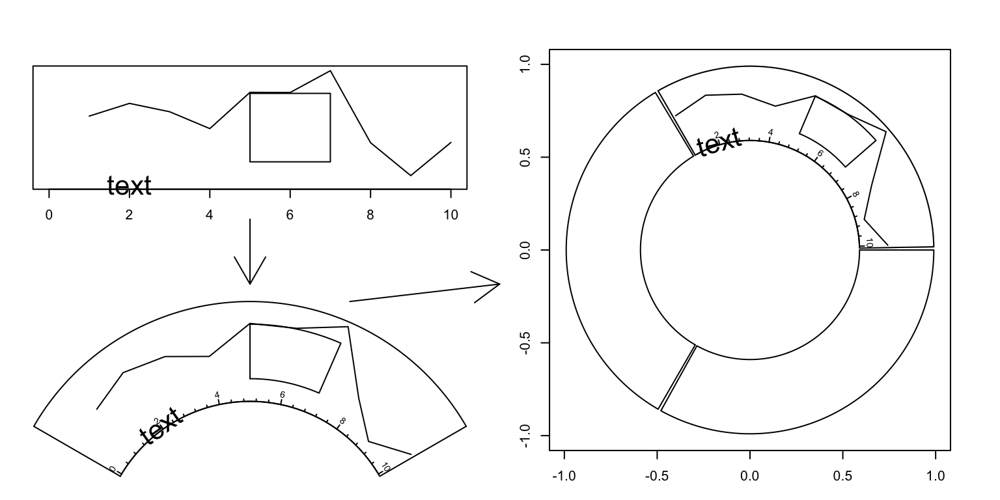
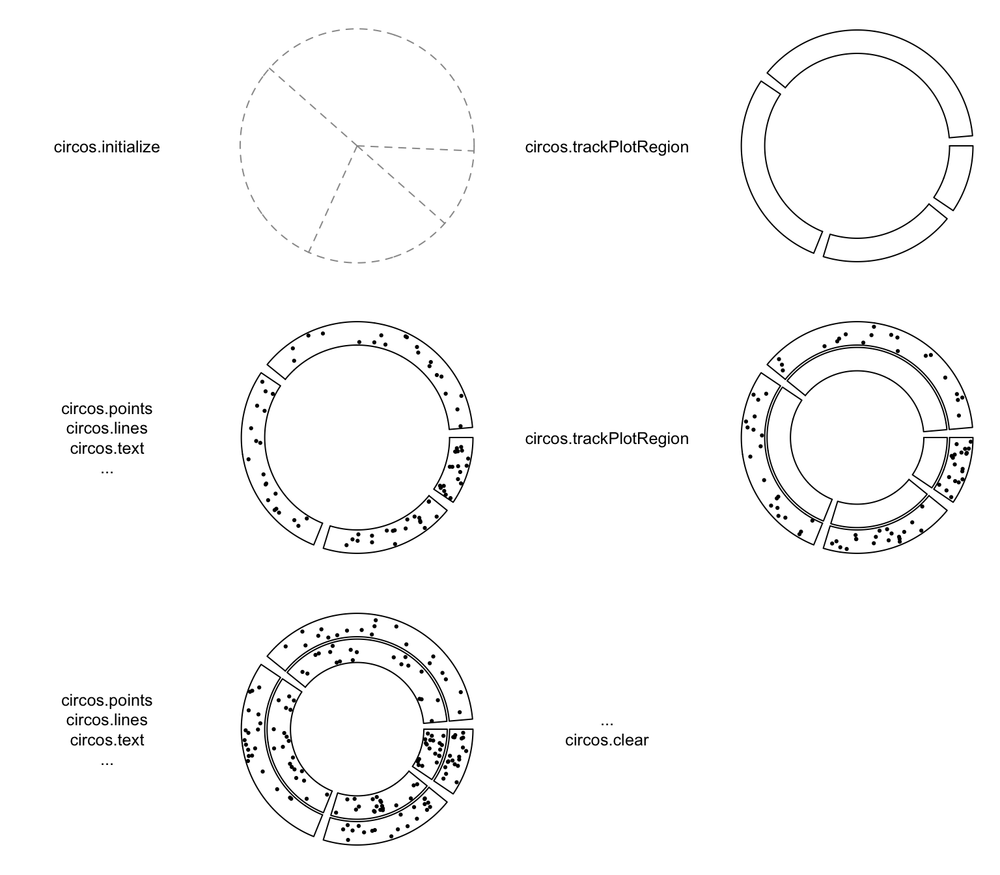
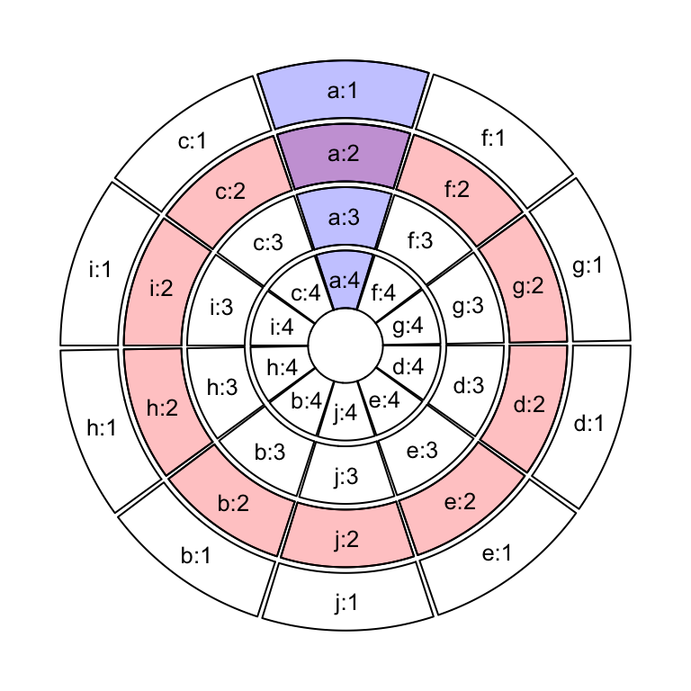
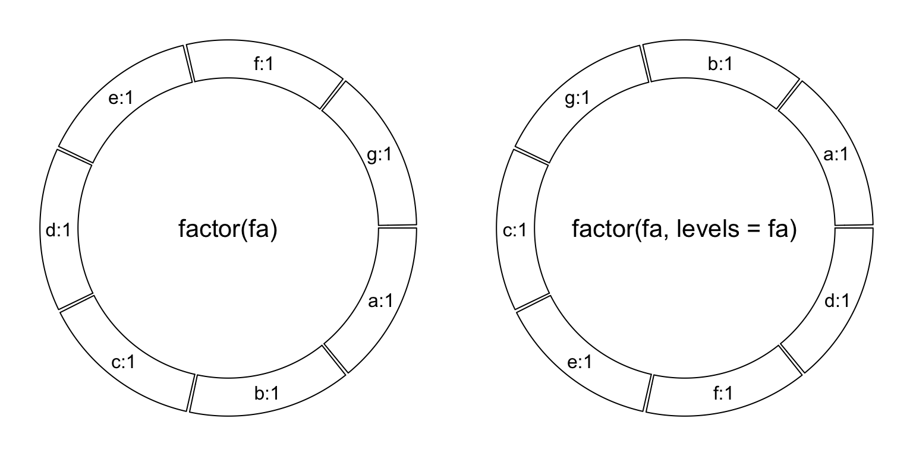
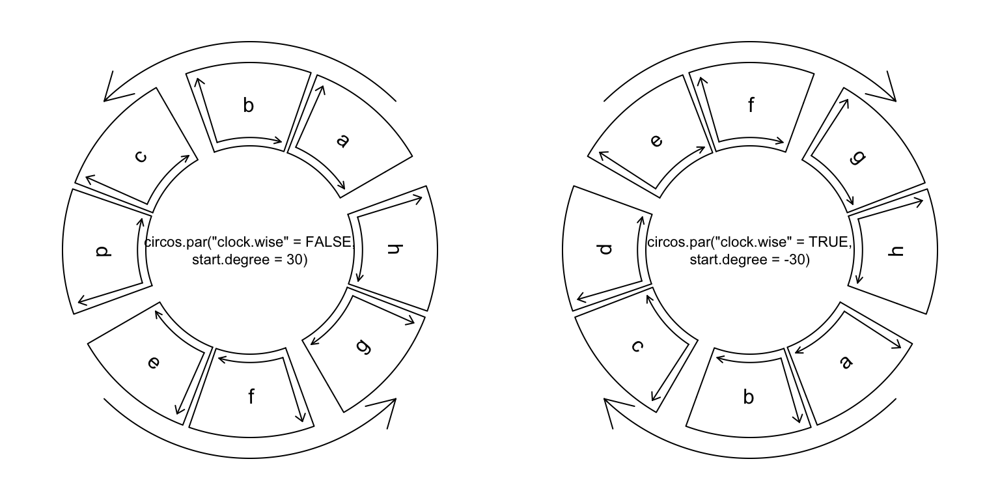
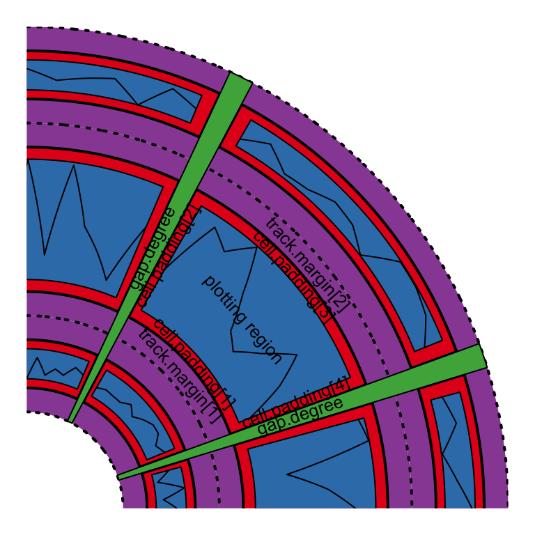
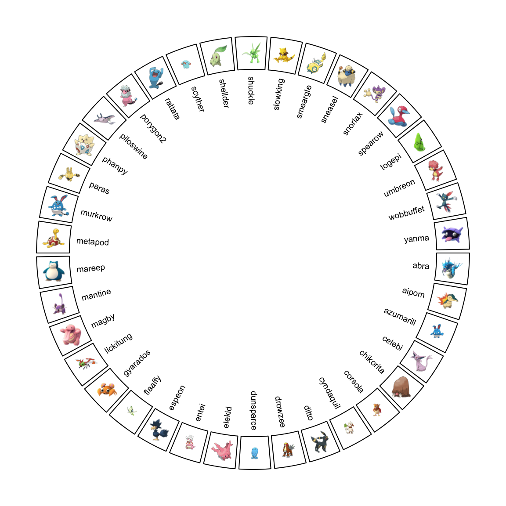

# Circular layout {#circular-layout}

## Coordinate transformation {#coordinate-transformation}

To map graphics onto the circle, there exist transformations from several
coordinate systems. First, there are **data coordinate systems** in which
ranges for x-axes and y-axes are the ranges of original data. Second, there is
a **polar coordinate system** in which these coordinates are mapped onto a
circle. Finally, there is a **canvas coordinate system** in which graphics are
really drawn on the graphical device (figure \@ref(fig:coordinate-transformation)). 
Each cell has its own data coordinate and they are
independent. **circlize** first transforms coordinates from data coordinate
system to polar coordinate system and finally transforms into canvas
coordinate system. For users, they only need to imagine that each cell is a
normal rectangular plotting region (data coordinate) in which x-lim and y-lim
are ranges of data in that cell. **circlize** knows which cell you are in and
does all the transformations automatically.

<div class="figure" style="text-align: center">

<p class="caption">(\#fig:coordinate-transformation)Transformation between different coordinates</p>
</div>

The final canvas coordinate is in fact an ordinary coordinate in the base R
graphic system with x range in `(-1, 1)` and y range in `(-1, 1)` by default.
It should be noted that **the circular plot is always drawn inside the circle which has
radius of 1 (which means it is always a unit circle), and from outside to
inside**.

## Rules for making the circular plot {#rules-for-making-the-circular-plot}

The rule for making the circular plot is rather simple. It follows the sequence of
`initialize layout -> create track -> add graphics -> create track -> add graphics - ... -> clear`.
Graphics can be added at any time as long as the tracks are created.
Details are shown in Figure \@ref(fig:circlize-order) and as follows:

<div class="figure" style="text-align: center">

<p class="caption">(\#fig:circlize-order)Order of drawing circular layout.</p>
</div>

1. Initialize the layout using `circos.initialize()`. Since circular layout in
   fact visualizes data which is in categories, there must be at least a
   categorical variable. Ranges of x values on each category can be specified
   as a vector or the range itself. See Section \@ref(sectors-and-tracks).
2. Create plotting regions for the new track and add graphics. The new track
   is created just inside the previously created one. Only after the creation
   of the track can you add other graphics on it. There are three ways to add
   graphics in cells.

   - After the creation of the track, use low-level graphic function like
     `circos.points()`, `circos.lines()`, ... to add graphics cell by
     cell. It always involves a `for` loop and you need to subset the data
     by the categorical variable manually.
   - Use `circos.trackPoints()`, `circos.trackLines()`, ... to add
     simple graphics through all cells simultaneously.
   - Use `panel.fun` argument in `circos.track()` to add graphics
     immediately after the creation of a certain cell. `panel.fun` needs
     two arguments `x` and `y` which are x values and y values that are in
     the current cell. This subset operation is applied automatically.
     This is the most recommended way. Section \@ref(panel-fun) gives
     detailed explanation of using `panel.fun` argument.
        
3. Repeat step 2 to add more tracks on the circle unless it reaches the center
   of the circle.
4. Call `circos.clear()` to clean up.

As mentioned above, there are three ways to add graphics on a track. 

1.   Create plotting regions for the whole track first and then add graphics
     by specifying `sector.index`. In the following pseudo code, `x1`, `y1`
     are data points in a given cell, which means you need to do data
     subsetting manually.

     In following code, `circos.points()` and `circos.lines()` are used
     separatedly from `circos.track()`, thus, the index for the sector needs
     to be explicitly specified by `sector.index` argument. There is also a
     `track.index` argument for both functions, however, the default value is
     the "current" track index and as the two functions are used just after
     `circos.track()`, the "current" track index is what the two functions
     expect and it can be ommited when calling the two functions.


```r
circos.initialize(factors, xlim)
circos.track(factors, ylim)
for(sector.index in all.sector.index) {
    circos.points(x1, y1, sector.index)
    circos.lines(x2, y2, sector.index)
}
```

2.   Add graphics in a batch mode. In following code, `circos.trackPoints()`
     and `circos.trackLines()` need a categorical variable, a vector of x
     values and a vector of y values. X and y values will be split by the
     categorical variable and sent to corresponding cell to add the graphics.
     Internally, this is done by using `circos.points()` or `circos.lines()`
     in a `for` loop. This way to add graphics would be convenient if users
     only want to add a specific type of simple graphics (e.g. only points) to
     the track, but it is not recommended for making complex graphics.

     `circos.trackPoints()` and `circos.trackLines()` need a `track.index` to
     specify which track to add the graphics. Similarly, since these two are
     called just after `circos.track()`, the graphics are added in the newly
     created track right away.


```r
circos.initialize(factors, xlim)
circos.track(factors, ylim)
circos.trackPoints(factors, x, y)
circos.trackLines(factors, x, y)
```

3.   Use a panel function to add self-defined graphics as soon as the cell has
     been created. This is the way recommended and you can find most of the
     code in this book uses `panel.fun`. `circos.track()` creates cells one by
     one and after the creation of a cell, and `panel.fun` is executed on this
     cell immediately. In this case, the "current" sector and "current" track
     are marked to this cell that you can directly use low-level functions
     without specifying sector index and track index.

     If you look at following code, you will find the code inside `panel.fun`
     is as natural as using `points()` or `lines()` in the normal R graphic
     system. This is a way to help you think a cell is an "imaginary
     rectangular plotting region".


```r
circos.initialize(factors, xlim)
circos.track(factors, all_x, all_y, ylim,
    panel.fun = function(x, y) {
        circos.points(x, y)
        circos.lines(x, y)
})
```

There are several internal variables keeping tracing of the current sector and
track when applying `circos.track()` and `circos.update()`. Thus, although
functions like `circos.points()`, `circos.lines()` need to specify the index
of sector and track, they will take the current one by default. As a result,
if you draw points, lines, text _et al_ just after the creation of the track
or cell, you do not need to set the sector index and the track index
explicitly and it will be added in the most recently created or updated cell.

## Sectors and tracks {#sectors-and-tracks}

A circular layout is composed of sectors and tracks. As illustrated in Figure
\@ref(fig:circlize-coordinate), the red circle is one track and the blue represents
one sector. The intersection of a sector and a track is called a cell which
can be thought as an imaginary plotting region for data points. In this
section, we introduce how to set data ranges on x and y directions in cells.

<div class="figure" style="text-align: center">

<p class="caption">(\#fig:circlize-coordinate)Sectors and tracks in circular layout.</p>
</div>

Sectors are first allocated on the circle by `circos.initialize()`. There must
be a categorical variable (say `factors`) that on the circle, each sector
corresponds to one category. The width of sectors (measured by degree) are proportional to the data
range in sectors on x direction (or the circular direction). The data range can be specified as a numeric
vector `x` which has same length as `factors`, then `x` is split by `factors`
and data ranges are calculated for each sector internally.

Data ranges can also be specified directly by `xlim` argument. The valid value
for `xilm` is a two-column matrix with same number of rows as number of
sectors that each row in `xlim` corresponds to one sector. If `xlim` has row
names which already cover sector names, row order of `xlim` is automatically
adjusted. If `xlim` is a vector of length two, all sectors have the same x range.


```r
circos.initialize(factors, x = x)
circos.initialize(factors, xlim = xlim)
```

After the initialization of the layout, you may not see anything drawn or only an
empty graphical device is opened. That is because no track has been created
yet, however, the layout has already been recorded internally.

In the initialization step, not only the width of each sector is assigned, but
also the order of sectors on the circle is determined. **Order of the sectors
are determined by the order of levels of the input factor**. If the value for
`factors` is not a factor, the order of sectors is `unique(factors)`. Thus, if
you want to change the order of sectors, you can just change of the level of
`factors` variable. The following code generates plots with different
sector orders (Figure \@ref(fig:circlize-factor)).


```r
fa = c("d", "f", "e", "c", "g", "b", "a")
f1 = factor(fa)
circos.initialize(factors = f1, xlim = c(0, 1))
f2 = factor(fa, levels = fa)
circos.initialize(factors = f2, xlim = c(0, 1))
```

<div class="figure" style="text-align: center">

<p class="caption">(\#fig:circlize-factor)Different sector orders.</p>
</div>

**In different tracks, cells in the same sector share the same data range on
x-axes.** Then, for each track, we only need to specify the data range on y
direction (or the radical direction) for cells. Similar as `circos.initialize()`, `circos.track()` also
receives either `y` or `ylim` argument to specify the range of y-values. Since
all cells in a same track shares a same y range, `ylim` is just a vector of
length two if it is specified.

`x` can also be specified in `circos.track()`, but it is only used to send to
`panel.fun`. In Section \@ref(panel-fun), we will introduce how `x` and `y`
are sent to each cell and how the graphics are added.


```r
circos.track(factors, y = y)
circos.track(factors, ylim = c(0, 1))
circos.track(factors, x = x, y = y)
```

In the track creation step, since all sectors have already been allocated in
the circle, if `factors` argument is not set, `circos.track()` would create
plotting regions for all available sectors. Also, levels of `factors` do
not need to be specified explicitly because the order of sectors has already
be determined in the initialization step. If users only create cells for a subset
of sectors in the track (not all sectors), in fact, cells in remaining
unspecified sectors are created as well, but with no borders (pretending they
are not created).


```r
# assume `factors` only covers a subset of sectors
# You will only see cells that are covered in `factors` have borders
circos.track(factors, y = y)
# You will see all cells have borders
circos.track(ylim = ranges(y))
```

Cells are basic units in the circular plot and are independent from each
other. After the creation of cells, they have self-contained meta values of
x-lim and y-lim (data range measured in data coordinate). So if you are adding
graphics in one cell, you do not need to consider things outside the cell and
also you do not need to consider you are in the circle. Just pretending it is
normal rectangle region with its own coordinate.

<div class="figure" style="text-align: center">

<p class="caption">(\#fig:circlize-direction)Sector directions.</p>
</div>

## Graphic parameters {#graphic-parameters}

Some basic parameters for the circular layout can be set by `circos.par()`.
These parameters are listed as follows. Note some parameters can only be
modified before the initialization of the circular layout.

- `start.degree`: The starting degree where the first sector is put. Note this
  degree is measured in the standard polar coordinate system which means it is always
  reverse clockwise. E.g. if it is set to 90, sectors start from the top
  center of the circle. See Figure \@ref(fig:circlize-direction).
- `gap.degree`: Gap between two neighbour sectors. It can be a single value
  which means all gaps share same degree, or a vector which has same number as
  sectors. **Note the first gap is after the first sector.** See Figure
  \@ref(fig:circlize-direction) and figure \@ref(fig:circlize-region).
- `gap.after`: Same as `gap.degree`, but more understandable. Modifying values
  of `gap.after` will also modify `gap.degree` and vice versa.
- `track.margin`: [Like `margin` in Cascading Style Sheets (CSS)](https://www.w3schools.com/css/css_margin.asp), it is the
  blank area out of the plotting region, also outside of the borders. Since
  left and right margin are controlled by `gap.after`, only bottom and top
  margin need to be set. The value for `track.margin` is the percentage to the
  radius of the unit circle. The value can also be set by `convert_height()`
  or the short version `uh()` function with absolute units. See figure
  \@ref(fig:circlize-region).
- `cell.padding`: Padding of the cell. [Like `padding` in Cascading Style
  Sheets (CSS)](https://www.w3schools.com/css/css_padding.asp), it is the blank area around the plotting regions, but within
  the borders. The parameter has four values, which control the bottom, left,
  top and right padding respectively. The first and the third padding values
  are the percentages to the radius of the unit circle, and the second and
  fourth values are the degrees. The first and the third value can be set by
  `uh()` with absolute units. See figure \@ref(fig:circlize-region).
- `unit.circle.segments`: Since curves are simulated by a series of straight
  lines, this parameter controls the amount of segments to represent a curve.
  The minimal length of the line segment is the length of the unit circle
  ($2\pi$) divided by `unit.circle.segments`. More segments means better
  approximation for the curves, while generate larger file size if figures are
  in PDF format. See explanantion in Section \@ref(lines).
- `track.height`: The default height of tracks. It is the percentage to the
  radius of the unit circle. The height includes the top and bottom cell
  paddings but not the margins. The value can be set by `uh()` with absolute
  units.
- `points.overflow.warning`: Since each cell is in fact not a real plotting
  region but only an ordinary rectangle (or more precisely, a circular
  rectangle), it does not remove points that are plotted outside of the
  region. So if some points (or lines, text) are out of the plotting region,
  by default, the package would continue drawing the points but with warning
  messages. However, in some circumstances, drawing something out of the
  plotting region is useful, such as adding some text annotations (like the
  first track in Figure \@ref(fig:circlize-glance-track-1)). Set this value to
  `FALSE` to turn off the warnings.
- `canvas.xlim`: The ranges in the canvas coordinate in x direction. **circlize** is
  forced to put everything inside the unit circle, so `canvas.xlim` and `canvas.ylim` 
  is `c(-1, 1)` by default. However, you can set it to a more
  broad interval if you want to leave more spaces out of the circle. By
  choosing proper `canvas.xlim` and `canvas.ylim`, actually you can customize
  the circle. E.g. setting `canvas.xlim` to `c(0, 1)` and `canvas.ylim` to
  `c(0, 1)` would only draw 1/4 of the circle.
- `canvas.ylim`: The ranges in the canvas coordinate in y direction.
- `clock.wise`: The order for drawing sectors. Default is `TRUE` which means
  clockwise (figure \@ref(fig:circlize-direction). **Note that inside each
  cell, the direction of x-axis is always clockwise and direction of y-axis is
  always from inside to outside in the circle.**

<div class="figure" style="text-align: center">

<p class="caption">(\#fig:circlize-region)Regions in a cell.</p>
</div>

Default values for graphic parameters are listed in following table.

-------------------------- ----------------------------
`start.degree`             `0` 
`gap.degree`/`gap.after`   `1`
`track.margin`             `c(0.01, 0.01)`
`cell.padding`             `c(0.02, 1.00, 0.02, 1.00)`
`unit.circle.segments`     `500`
`track.height`             `0.2`
`points.overflow.warning`  `TRUE`
`canvas.xlim`              `c(-1, 1)`
`canvas.ylim`              `c(-1, 1)`
`clock.wise`               `TRUE` 
-------------------------- ---------------------------

Parameters related to the allocation of sectors cannot be changed after the
initialization of the circular layout. Thus, `start.degree`,
`gap.degree`/`gap.after`, `canvas.xlim`, `canvas.ylim` and `clock.wise` can
only be modified before `circos.initialize()`. The second and the fourth
values of `cell.padding` (left and right paddings) can not be modified neither
(or will be ignored).

Similar reason, since some of the parameters are defined before the initialization
of the circular layout, after making each plot, you need to call `circos.clear()`
to manually reset all the parameters.

## Create plotting regions {#create-plotting-regions}

As described above, only after creating the plotting region can you add low-
level graphics on it. The minimal set of arguments for `circos.track()` is to set
either `y` or `ylim` which assigns range of y values for this track.
`circos.track()` creates tracks for all sectors although in some case only
parts of them are visible.

If `factors` is not specified, all cells in the track will be created with the
same settings. If `factors`, `x` and `y` are set, they need to be vectors with
the same length. Proper values of `x` and `y` that correspond to current cell
will be passed to `panel.fun` by subsetting `factors` internally. Section
\@ref(panel-fun) explains the usage of `panel.fun`.

Graphic arguments such as `bg.border` and `bg.col` can either be a scalar or a
vector. If it is a vector, the length must be equal to the number of sectors and the order
corresponds to the order of sectors.
Thus, you can create plot regions with different styles of borders and
background colors.

If you are confused with the `factors` orders, you can also customize the
borders and background colors inside `panel.fun`.
`get.cell.meta.data("cell.xlim")` and `get.cell.meta.data("cell.ylim")` give
you dimensions of the plotting region and you can customize plot regions
directly by e.g. `circos.rect(col = "#FF000040", border = 1)`.

`circos.track()` provides `track.margin` and `cell.padding` arguments that
they only control track margins and cell paddings for the current track. Of course
the second and fourth value in `cell.padding` are ignored.

## Update plotting regions {#update-plotting-regions}

`circos.track()` creates new tracks, however, if `track.index` argument is set
to a track which already exists, `circos.track()` actually **re-creates** this
track. In this case, coordinates on y directions can be re-defined, but
settings related to the positions of the track such as the height of the track
can not be modified.


```r
circos.track(factors, ylim = c(0, 1), track.index = 1, ...)
```

For a single cell, `circos.update()` can be used to erase all graphics that
have been already added in the cell. However, the data coordinate in the cell
keeps unchanged.


```r
circos.update(sector.index, track.index)
circos.points(x, y, sector.index, track.index)
```

## `panel.fun` argument {#panel-fun}

`panel.fun` argument in `circos.track()` is extremely useful to apply plotting
as soon as the cell has been created. This self-defined function needs two
arguments `x` and `y` which are data points that belong to this cell. The
value for `x` and `y` are automatically extracted from `x` and `y` in
`circos.track()` according to the category defined in `factors`. In the
following example, inside `panel.fun`, in sector `a`, the value of `x` is
`1:3` and in sector `b`, value of `x` is `4:5`. If `x` or `y` in
`circos.track()` is `NULL`, then `x` or `y` inside `panel.fun` is also `NULL`.


```r
factors = c("a", "a", "a", "b", "b")
x = 1:5
y = 5:1
circos.track(factors = factors, x = x, y = y,
    panel.fun = function(x, y) {
        circos.points(x, y)
})
```

In `panel.fun`, one thing important is that if you use any low-level graphic
functions, you don't need to specify `sector.index` and `track.index`
explicitly. Remember that when applying `circos.track()`, cells in the track
are created one after one. When a cell is created, **circlize** would set the
sector index and track index of the cell as the 'current' index. When the cell
is created, `panel.fun` is executed immediately. Without specifying
`sector.index` and `track.index`, the 'current' ones are used and that's
exactly what you need.

The advantage of `panel.fun` is that it makes you feel you are using graphic
functions in the base graphic engine (You can see it is almost the same of
using `circos.points(x, y)` and `points(x, y)`). It will be much easier for
users to understand and customize new graphics.

Inside `panel.fun`, information of the 'current' cell can be obtained through
`get.cell.meta.data()`. Also this function takes the 'current' sector and
'current' track by default.


```r
get.cell.meta.data(name)
get.cell.meta.data(name, sector.index, track.index)
```

Information that can be extracted by `get.cell.meta.data()` are:

- `sector.index`: The name for the sector.
- `sector.numeric.index`: Numeric index for the sector.
- `track.index`: Numeric index for the track.
- `xlim`: Minimal and maximal values on the x-axis.
- `ylim`: Minimal and maximal values on the y-axis.
- `xcenter`: mean of `xlim`.
- `ycenter`: mean of `ylim`.
- `xrange`: defined as `xlim[2] - xlim[1]`.
- `yrange`: defined as `ylim[2] - ylim[1]`.
- `cell.xlim`: Minimal and maximal values on the x-axis extended by cell
  paddings.
- `cell.ylim`: Minimal and maximal values on the y-axis extended by cell
  paddings.
- `xplot`: Degree of right and left borders in the plotting region. The first
  element corresponds to the start point of values on x-axis and the second element corresponds to the end point of values
  on x-axis Since x-axis in data coordinate in cells are
  always clockwise, `xplot[1]` is larger than `xplot[2]`.
- `yplot`: Radius of bottom and top radius in the plotting region.
- `cell.start.degree`: Same as `xplot[1]`.
- `cell.end.degree`: Same as `xplot[2]`.
- `cell.bottom.radius`: Same as `yplot[1]`.
- `cell.top.radius`: Same as `yplot[2]`.
- `track.margin`: Margins of the cell.
- `cell.padding`: Paddings of the cell.

Following example code uses `get.cell.meta.data()` to add sector index in the
center of each cell.


```r
circos.track(ylim = ylim, panel.fun = function(x, y) {
    sector.index = get.cell.meta.data("sector.index")
    xcenter = get.cell.meta.data("xcenter")
    ycenter = get.cell.meta.data("ycenter")
    circos.text(xcenter, ycenter, sector.index)
})
```

`get.cell.meta.data()` can also be used outside `panel.fun`, but you need to
explictly specify `sector.index` and `track.index` arguments unless the current
index is what you want.

There is a companion variable `CELL_META` which is identical to
`get.cell.meta.data()` to get cell meta information, but easier and shorter to
write. Actually, the value of `CELL_META` itself is meaningless, but e.g.
`CELL_META$sector.index` is automatically redirected to
`get.cell.meta.data("sector.index")`. Following code rewrites above example
code with `CELL_META`.


```r
circos.track(ylim = ylim, panel.fun = function(x, y) {
    circos.text(CELL_META$xcenter, CELL_META$ycenter, 
        CELL_META$sector.index)
})
```

Please note `CELL_META` only extracts information for the "current" cell, thus,
it is recommended to use only in `panel.fun`.

Nevertheless, if you have several lines of code which need to be executed out of `panel.fun`,
you can flag the specified cell as the "current" cell by `set.current.cell()`, which can save you from typing
too many `sector.index = ..., track.index = ...`. E.g. following code 


```r
circos.text(get.cell.meta.data("xcenter", sector.index, track.index),
            get.cell.meta.data("ycenter", sector.index, track.index),
            get.cell.meta.data("sector.index", sector.index, track.index),
            sector.index, track.index)
```

can be simplified to:


```r
set.current.cell(sector.index, track.index)
circos.text(get.cell.meta.data("xcenter"),
            get.cell.meta.data("ycenter"),
            get.cell.meta.data("sector.index"))
# or more simple
circos.text(CELL_META$xcenter, CELL_META$ycenter, CELL_META$sector.index)
```

## Other utilities {#other-utilities}

### `circlize()` and `reverse.circlize()` {#circlize_and_reverse_circlize}

**circlize** transform data points in several coordinate systems and it is
basically done by the core function `circlize()`. The function transforms from data
coordinate (coordinate in the cell) to the polar coordinate and its companion
`reverse.circlize()` transforms from polar coordinate to a specified data coordinate. The
default transformation is applied in the `current` cell.


```r
factors = c("a", "b")
circos.initialize(factors, xlim = c(0, 1))
circos.track(ylim = c(0, 1))
# x = 0.5, y = 0.5 in sector a and track 1
circlize(0.5, 0.5, sector.index = "a", track.index = 1)
```

```
##      theta  rou
## [1,] 270.5 0.89
```

```r
# theta = 90, rou = 0.9 in the polar coordinate
reverse.circlize(90, 0.9, sector.index = "a", track.index = 1)
```

```
##             x    y
## [1,] 1.519774 0.56
```

```r
reverse.circlize(90, 0.9, sector.index = "b", track.index = 1)
```

```
##              x    y
## [1,] 0.5028249 0.56
```

You can see the results are different for two `reverse.circlize()` calls
although it is the same points in the polar coordinate, because they are
mapped to different cells.

`circlize()` and `reverse.circlize()` can be used to connect two circular
plots if they are drawn on a same page. This provides a way to build more
complex plots. Basically, the two circular plots share a same polar
coordiante, then, the manipulation of `circlize->reverse.circlize->circlize`
can transform coordinate for data points from the first circular plot to the
second. In Chapter \@ref(nested-zooming), we use this technique to combine two
circular plots where one zooms subset of regions in the other one.

The transformation between polar coordinate and canvas coordinate is simple.
**circlize** has a `circlize:::polar2Cartesian()` function but this function
is not exported.

Following example (Figure \@ref(fig:circular-pokemon)) adds raster image to the circular plot. The raster image is added
by `rasterImage()` which is applied in the canvas coordinate. Note how we change
coordinate from data coordinate to canvas coordinate by using `circlize()`
and `circlize:::polar2Cartesian()`.


```r
library(yaml)
data = yaml.load_file("https://raw.githubusercontent.com/Templarian/slack-emoji-pokemon/master/pokemon.yaml")
set.seed(123)
pokemon_list = data$emojis[sample(length(data$emojis), 40)]
pokemon_name = sapply(pokemon_list, function(x) x$name)
pokemon_src = sapply(pokemon_list, function(x) x$src)

library(EBImage)
circos.par("points.overflow.warning" = FALSE)
circos.initialize(pokemon_name, xlim = c(0, 1))
circos.track(ylim = c(0, 1), panel.fun = function(x, y) {
    pos = circlize:::polar2Cartesian(circlize(CELL_META$xcenter, CELL_META$ycenter))
    image = EBImage::readImage(pokemon_src[CELL_META$sector.numeric.index])
    circos.text(CELL_META$xcenter, CELL_META$cell.ylim[1] - uy(2, "mm"),
        CELL_META$sector.index, facing = "clockwise", niceFacing = TRUE,
        adj = c(1, 0.5), cex = 0.6)
    rasterImage(image, 
        xleft = pos[1, 1] - 0.05, ybottom = pos[1, 2] - 0.05,
        xright = pos[1, 1] + 0.05, ytop = pos[1, 2]+ 0.05)
}, bg.border = 1, track.height = 0.15)
```

```
## Warning in readPNG(x, ...): libpng warning: iCCP: known incorrect sRGB profile

## Warning in readPNG(x, ...): libpng warning: iCCP: known incorrect sRGB profile

## Warning in readPNG(x, ...): libpng warning: iCCP: known incorrect sRGB profile

## Warning in readPNG(x, ...): libpng warning: iCCP: known incorrect sRGB profile

## Warning in readPNG(x, ...): libpng warning: iCCP: known incorrect sRGB profile
```

<div class="figure" style="text-align: center">

<p class="caption">(\#fig:circular-pokemon)Add raster image to the circular plot.</p>
</div>

```r
circos.clear()
```

In **circlize** package, there is a `circos.raster()` function which directly
adds raster images. It is introduced in Section \@ref(raster-image).

### The convert functions {#convert-functions}

For the functions in **circlize** package, they needs arguments which are
lengths measured either in the canvas coordinate or in the data coordinate.
E.g. `track.height` argument in `circos.track()` corresponds to percent of
radius of the unit circle. **circlize** package is built in the R base graphic
system which is not straightforward to define a length with absolute units
(e.g. a line of length 2 cm). To solve this problem, **circlize** provides
three functions which convert absolute units to the canvas coordinate or the
data coordinate accordingly.

`convert_length()` converts absolute units to the canvas coordinate. Since the
aspect ratio for canvas coordinate is always set to 1, it doesn't matter
whether to convert units in the x direction or in the y direction. The usage
of `convert_length()` is straightforward, supported units are `mm`, `cm` and
`inches`. If users want to convert a string height or width to the canvas coordinate,
directly use `strheight()` or `strwidth()` functions.


```r
convert_length(2, "mm")
```

Since `convert_length()` is mostly used to define heights on the radical
direction, e.g. track height or height of track margins, the function has
another name `convert_height()`, or the short name `uh()` (stands for _unit height_).

`convert_x()` and `convert_y()`, or the short version `ux()` and `uy()` (_unit x_ and _unit y_),
convert absolute units to the data coordinate. By default, the conversion is
applied in the "current" cell, but it can still be used in other cells by specifying `sector.index`
and `track.index` arguments. Since the width of the cell is not identical from the top to
the bottom in the cell, for `convert_x()` or `ux()` function, the position on
y direction where the convert is applied needs to be specified. By default it
is at the middle point on y-axis.

Following plot (Figure \@ref(fig:unit-convert)) is an example of setting absolute units.


```r
fa = letters[1:10]
circos.par(cell.padding = c(0, 0, 0, 0), track.margin = c(0, 0))
circos.initialize(fa, xlim = cbind(rep(0, 10), runif(10, 0.5, 1.5)))
circos.track(ylim = c(0, 1), track.height = uh(5, "mm"),
    panel.fun = function(x, y) {
        circos.lines(c(0, 0 + ux(5, "mm")), c(0.5, 0.5), col = "blue")
    })
circos.track(ylim = c(0, 1), track.height = uh(1, "cm"),
    track.margin = c(0, uh(2, "mm")),
    panel.fun = function(x, y) {
        xcenter = get.cell.meta.data("xcenter")
        circos.lines(c(xcenter, xcenter), c(0, uy(1, "cm")), col = "red")
    })
circos.track(ylim = c(0, 1), track.height = uh(1, "inches"),
    track.margin = c(0, uh(5, "mm")),
    panel.fun = function(x, y) {
        line_length_on_x = ux(1*sqrt(2)/2, "cm")
        line_length_on_y = uy(1*sqrt(2)/2, "cm")
        circos.lines(c(0, line_length_on_x), c(0, line_length_on_y), col = "orange")
    })
```

<div class="figure" style="text-align: center">

<p class="caption">(\#fig:unit-convert)Setting absolute units</p>
</div>

```r
circos.clear()
```

### `circos.info()` and `circos.clear()` {#circos-info-and-circos-clear}

You can get basic information of your current circular plot by
`circos.info()`. The function can be called at any time.


```r
factors = letters[1:3]
circos.initialize(factors = factors, xlim = c(1, 2))
circos.info()
```

```
## All your sectors:
## [1] "a" "b" "c"
## 
## No track has been created
## 
## Your current sector.index is a
```

```r
circos.track(ylim = c(0, 1))
circos.info(sector.index = "a", track.index = 1)
```

```
## sector index: 'a'
## track index: 1
## xlim: [1, 2]
## ylim: [0, 1]
## cell.xlim: [0.991453, 2.008547]
## cell.ylim: [-0.1, 1.1]
## xplot (degree): [0, 241]
## yplot (radius): [0.79, 0.99]
## track.margin: c(0.01, 0.01)
## cell.padding: c(0.02, 1, 0.02, 1)
## 
## Your current sector.index is c
## Your current track.index is 1
```

```r
circos.clear()
```

It can also add labels to all cells by `circos.info(plot = TRUE)`.

You should always call `circos.clear()` at the end of every circular plot.
There are several parameters for circular plot which can only be set before
`circos.initialize()`, thus, before you draw the next circular plot, you need
to reset all these parameters.
