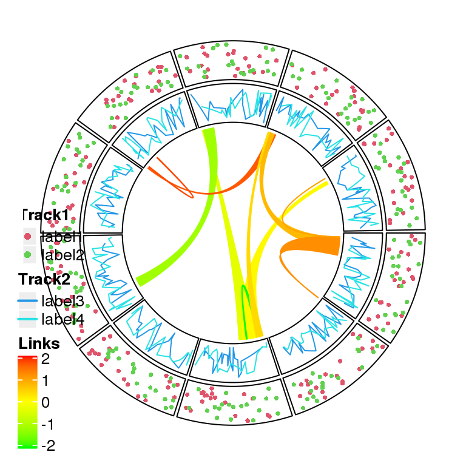
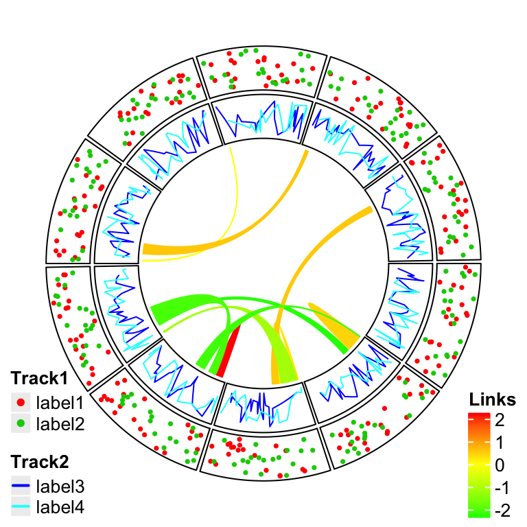
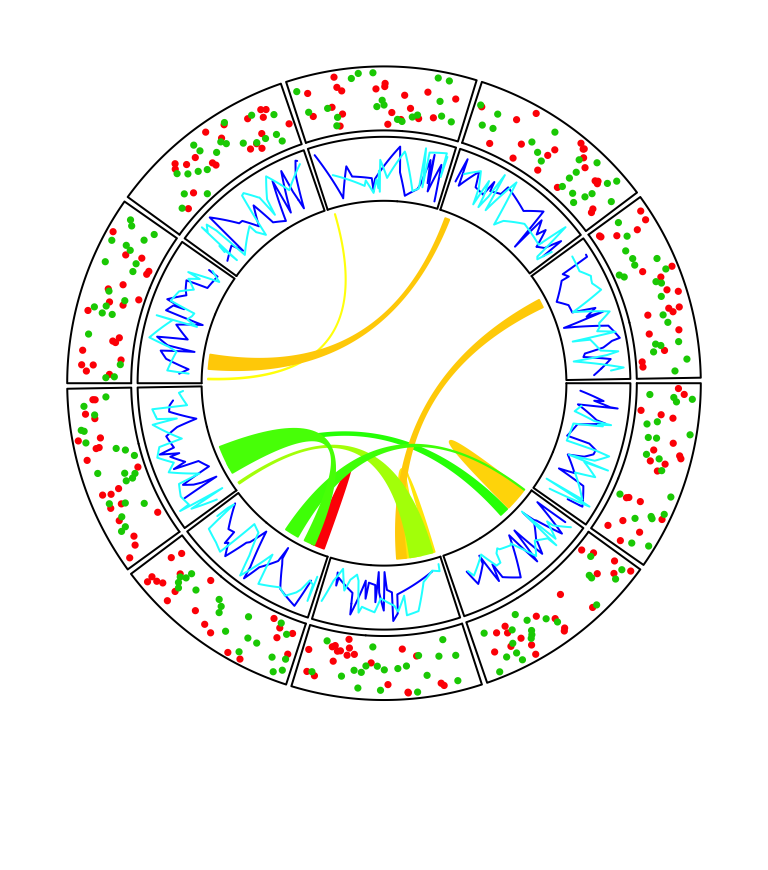

# Legends {#legends}


**circlize** provides complete freedom for users to design their own graphics
by implementing the self-defined function `panel.fun`. However one drawback
arises that **circlize** is completely blind to users' data so that one
important thing is missing for the visualization which is the legend.

Although legends cannot be automatically generated by **circlize**, by using
functionality from other R packages, it is just a few more lines to really
implement it. Here I will demonstrate how to customize legends and arrange to
the circular plot.

As an example, a circular plot which contains two tracks and links inside the
circle is generated. The first track will have a legend that contains points,
the second track will have a legend that contains lines, and the links
correspond to a continuous color mapping. The code is wrapped into a function
so that it can be used repeatedly.


```r
library(circlize)

col_fun = colorRamp2(c(-2, 0, 2), c("green", "yellow", "red"))
circlize_plot = function() {
    set.seed(12345)
    fa = letters[1:10]
    circos.initialize(fa, xlim = c(0, 1))
    circos.track(ylim = c(0, 1), panel.fun = function(x, y) {
        circos.points(runif(20), runif(20), cex = 0.5, pch = 16, col = 2)
        circos.points(runif(20), runif(20), cex = 0.5, pch = 16, col = 3)
    })
    circos.track(ylim = c(0, 1), panel.fun = function(x, y) {
        circos.lines(sort(runif(20)), runif(20), col = 4)
        circos.lines(sort(runif(20)), runif(20), col = 5)
    })

    for(i in 1:10) {
        circos.link(sample(fa, 1), sort(runif(10))[1:2], 
                    sample(fa, 1), sort(runif(10))[1:2],
                    col = add_transparency(col_fun(rnorm(1))))
    }
    circos.clear()
}
```

In **ComplexHeatmap** package with version higher than 1.13.2, there is a
`Legend()` function which customizes legends with various styles. In following
code, legends for the two tracks and links are constructed. In the end the
three legends are packed vertically by `packLegend()`. For more detailed usage
of `Legend()` and `packLegend()`, please refer to their help pages.


```r
library(ComplexHeatmap)
# discrete
lgd_points = Legend(at = c("label1", "label2"), type = "points", 
    legend_gp = gpar(col = 2:3), title_position = "topleft", 
    title = "Track1")
# discrete
lgd_lines = Legend(at = c("label3", "label4"), type = "lines", 
    legend_gp = gpar(col = 4:5, lwd = 2), title_position = "topleft", 
    title = "Track2")
# continuous
lgd_links = Legend(at = c(-2, -1, 0, 1, 2), col_fun = col_fun, 
    title_position = "topleft", title = "Links")

lgd_list_vertical = packLegend(lgd_points, lgd_lines, lgd_links)
lgd_list_vertical
```

```
## frame[GRID.frame.65]
```

`lgd_points`, `lgd_lines`, `lgd_links` and `lgd_list_vertical` are all `grob`
objects (graphical objects) defined by **grid** package, which you can think
as boxes which contain all graphical elements for legends and they can be
added to the plot by `grid.draw()`.

**circlize** is implemented in the base graphic system while
**ComplexHeatmap** is implemented by **grid** graphic system. However, these
two systems can be mixed somehow. We can directly add grid graphics to the base
graphics. (Actually they are two independent layers but drawn on a same
graphic device.)


```r
circlize_plot()
# next the grid graphics are added directly to the plot
# where circlize has created.
pushViewport(viewport(x = unit(2, "mm"), y = unit(4, "mm"), 
    width = grobWidth(lgd_list_vertical), 
    height = grobHeight(lgd_list_vertical), 
    just = c("left", "bottom")))
grid.draw(lgd_list_vertical)
upViewport()
```

<div class="figure" style="text-align: center">

<p class="caption">(\#fig:directly-add)Directly add grid graphics.</p>
</div>

In Figure \@ref(fig:directly-add), the whole image region corresponds to the
circular plot and the legend layer is drawn just on top of it. Actually you
can see that one big problem is when there are many legends that the size for
the legends is too big, they may overap to the circle. One solution is to
split the legends into several parts and add each part to different corners in
the plot (Figure \@ref(fig:two-legends)).


```r
lgd_list_vertical2 = packLegend(lgd_points, lgd_lines)
circlize_plot()
# next the grid graphics are added directly to the plot
# where circlize has created.
pushViewport(viewport(x = unit(2, "mm"), y = unit(2, "mm"), 
    width = grobWidth(lgd_list_vertical2), 
    height = grobHeight(lgd_list_vertical2), 
    just = c("left", "bottom")))
grid.draw(lgd_list_vertical2)
upViewport()
pushViewport(viewport(x = unit(1, "npc") - unit(2, "mm"), y = unit(2, "mm"), 
    width = grobWidth(lgd_links), 
    height = grobHeight(lgd_links), 
    just = c("right", "bottom")))
grid.draw(lgd_links)
upViewport()
```

<div class="figure" style="text-align: center">

<p class="caption">(\#fig:two-legends)Split into two legends.</p>
</div>

Still it can not solve the problem and sometimes it even makes the plot so
messed up. One better way is to split the image region into two parts where
one part only for the circular plot and the other part for legends.

To mix grid graphics and base graphics, ther are two important packages to
use: the **grid** package and **gridBase** package. **grid** is the base for
making grid graphics as well as arranging plotting regions (or, _viewports_ in
**grid** term), and **gridBase** makes it easy to integrate base graphics into
grid system.

Following code is straightforward to understand. Only one line needs to be
noticed: `par(omi = gridOMI(), new = TRUE)` that `gridOMI()` calculates the
outer margins for the base graphics so that the base graphics can be put at
the correct place and `new = TRUE` to ensure the base graphics are added to
current graphic device instead of opening a new one.

Here I use `plot.new()` to open a new graphic device. In interactive session,
it seems ok if you also use `grid.newpage()`, but `grid.newpage()` gives error
when building a **knitr** document.


```r
library(gridBase)
plot.new()
circle_size = unit(1, "snpc") # snpc unit gives you a square region

pushViewport(viewport(x = 0, y = 0.5, width = circle_size, height = circle_size,
    just = c("left", "center")))
par(omi = gridOMI(), new = TRUE)
circlize_plot()
upViewport()

pushViewport(viewport(x = circle_size, y = 0.5, width = grobWidth(lgd_list_vertical), 
    height = grobHeight(lgd_list_vertical), just = c("left", "center")))
grid.draw(lgd_list_vertical)
upViewport()
```


The legends can also be put at the bottom of the circular plot and it is just
a matter how users arrange the grid viewports. In this case, all legends are
changed to horizontal style, and three legends are packed horizontally as
well.


```r
lgd_points = Legend(at = c("label1", "label2"), type = "points", 
    legend_gp = gpar(col = 2:3), title_position = "topleft", 
    title = "Track1", nrow = 1)

lgd_lines = Legend(at = c("label3", "label4"), type = "lines", 
    legend_gp = gpar(col = 4:5, lwd = 2), title_position = "topleft", 
    title = "Track2", nrow = 1)

lgd_links = Legend(at = c(-2, -1, 0, 1, 2), col_fun = col_fun, 
    title_position = "topleft", title = "Links", direction = "horizontal")

lgd_list_horizontal = packLegend(lgd_points, lgd_lines, lgd_links, 
    direction = "horizontal")
```

Similar code to arrange viewports.


```r
plot.new()
pushViewport(viewport(x = 0.5, y = 1, width = circle_size, height = circle_size,
    just = c("center", "top")))
par(omi = gridOMI(), new = TRUE)
circlize_plot()
upViewport()

pushViewport(viewport(x = 0.5, y = unit(1, "npc") - circle_size, 
    width = grobWidth(lgd_list_horizontal), height = grobHeight(lgd_list_horizontal), 
    just = c("center", "top")))
grid.draw(lgd_list_horizontal)
upViewport()
```



