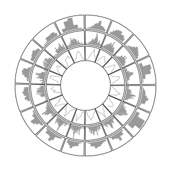
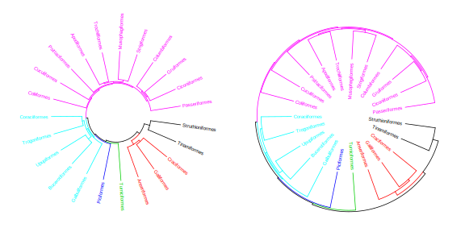

# Implement high-level circular plots {#high-level-plots}

In this chapter, we show several examples which combine low-level graphic
functions to construct complicated graphics for specific purposes. 

## Circular barplots {#circular-barplot}

In the following code, we put all the nine bars in one track and one sector.
You can also put them into 9 tracks, but the code would be very similar. See
Figure \@ref(fig:circular-barplot).


```r
category = paste0("category", "_", 1:9)
percent = sort(sample(40:80, 9))
color = rev(rainbow(length(percent)))

library(circlize)
circos.par("start.degree" = 90, cell.padding = c(0, 0, 0, 0))
circos.initialize("a", xlim = c(0, 100)) # 'a` just means there is one sector
circos.track(ylim = c(0.5, length(percent)+0.5), track.height = 0.8, 
    bg.border = NA, panel.fun = function(x, y) {
        xlim = CELL_META$xlim
        circos.segments(rep(xlim[1], 9), 1:9,
                        rep(xlim[2], 9), 1:9,
                        col = "#CCCCCC")
        circos.rect(rep(0, 9), 1:9 - 0.45, percent, 1:9 + 0.45,
        	col = color, border = "white")
        circos.text(rep(xlim[1], 9), 1:9, 
        	paste(category, " - ", percent, "%"), 
            facing = "downward", adj = c(1.05, 0.5), cex = 0.8) 
        breaks = seq(0, 85, by = 5)
        circos.axis(h = "top", major.at = breaks, labels = paste0(breaks, "%"), 
        	labels.cex = 0.6)
})
```

<div class="figure" style="text-align: center">

<p class="caption">(\#fig:circular-barplot)A circular barplot.</p>
</div>

```r
circos.clear()
```

When adding text by `circos.text()`, `adj` is specified to `c(1.05, 0.5)`
which means text is aligned to the right and there is also offset between the
text and the anchor points. We can also use `ux()` to set the offset to
absolute units. Conversion on x direction in a circular coordinate is affected
by the position on y axis, here we must set the `h` argument. Following code
can be used to replace the `circos.text()` in above example.


```r
circos.text(xlim[1] - ux(2, "mm", h = 1:9), 1:9, 
	paste(category, " - ", percent, "%"), 
    facing = "downward", adj = c(1, 0.5), cex = 0.8)
```

## Histograms {#histograms}

**circlize** ships a `circos.trackHist()` function which draws histograms in
cells. This function is a high-level function which caculates data ranges on y
axes and creates a new track. The implement of this function is simple, that it
first calculates the histogram in each cell by `hist()` function, then draws
histogram by using `circos.rect()`.

Users can choose to visualize data distributions by density lines by setting
`draw.density = TRUE`.

Figure \@ref(fig:circular-histograms) shows a histogram track under default
settings, a histogram track with specified `bin.size` and a track with density
lines. By default, bin size of histogram in each cell is calculated
separatedly and they will be different between cells, which makes it not
consistent to compare. Manually setting `bin.size` in all cells to a same
value helps to compare the distributions between cells.


```r
x = rnorm(1600)
factors = sample(letters[1:16], 1600, replace = TRUE)
circos.initialize(factors = factors, x = x)
circos.trackHist(factors = factors, x = x, col = "#999999", 
	border = "#999999")
circos.trackHist(factors = factors, x = x, bin.size = 0.1, 
	col = "#999999", border = "#999999")
circos.trackHist(factors = factors, x = x, draw.density = TRUE, 
	col = "#999999", border = "#999999")
```

<div class="figure" style="text-align: center">

<p class="caption">(\#fig:circular-histograms)Histograms on circular layout.</p>
</div>

```r
circos.clear()
```

## Phylogenetic trees {#phylogenetic-trees}

Circular dendrograms have many applications, one of which is to visualize 
phylogenetic trees. Basically, a phylogenetic tree is 
a dendrogram which is a combination of lines. In R, there are several classes that 
describe such type of tree such as `hclust`, `dendrogram` and `phylo`. 
In this example, we will demonstrate how to draw the tree from the `dendrogram` class. 
Nevertheless, other classes can be converted to `dendrogram` without too much difficulty.

The `bird.orders` data we are using here is from **ape** package. This data set is 
related to species of birds. 


```r
library(ape)
data(bird.orders)
hc = as.hclust(bird.orders)
```


We split the tree into six sub trees by `cutree()` and convert the data into a
`dendrogram` object.


```r
labels = hc$labels  # name of birds
ct = cutree(hc, 6)  # cut tree into 6 pieces
n = length(labels)  # number of bird species
dend = as.dendrogram(hc)
```

As we mentioned before, the x-value for the phylogenetic tree is in fact
index. Thus, the x-lim is just the minimum and maximum index of labels in the
tree. Since there is only one phylogenetic tree, we only need one "big"
sector. 

In the first track, we plot the name of each bird, with different
colors to represent different sub trees.


```r
circos.par(cell.padding = c(0, 0, 0, 0))
circos.initialize(factors = "a", xlim = c(0, n)) # only one sector
circos.track(ylim = c(0, 1), bg.border = NA, track.height = 0.3, 
    panel.fun = function(x, y) {
        for(i in seq_len(n)) {
            circos.text(i-0.5, 0, labels[i], adj = c(0, 0.5), 
                facing = "clockwise", niceFacing = TRUE,
                col = ct[labels[i]], cex = 0.5)
        }
})
```

In the above code, setting `xlim` to `c(0, n)` is very important because the
leaves of the dendrogram are drawn at `x = seq(0.5, n - 0.5)`.

In the second track, we plot the circular dendrogram by `circos.dendrogram()` (Figure \@ref(fig:phylogenetic-tree) left).
You can render the dendrogram by **dendextend** package.


```r
suppressPackageStartupMessages(library(dendextend))
dend = color_branches(dend, k = 6, col = 1:6)
dend_height = attr(dend, "height")
circos.track(ylim = c(0, dend_height), bg.border = NA, 
    track.height = 0.4, panel.fun = function(x, y) {
        circos.dendrogram(dend)
})
circos.clear()
```

By default, dendrograms are facing outside of the circle (so that the labels
should also be added outside the dendrogram). In `circos.dendrogram()`, you
can set `facing` argument to `inside` to make them facing inside. In this
case, dendrogram track is added first and labels are added later (Figure \@ref(fig:phylogenetic-tree) right).


```r
circos.dendrogram(dend, facing = "inside")
```


<div class="figure" style="text-align: center">

<p class="caption">(\#fig:phylogenetic-tree)A circular phylogenetic tree.</p>
</div>

If you look at the souce code of `circos.dendrogram()` and replace
`circos.lines()` to `lines()`, actually the function can correctly make a
dendrogram in the normal coordinate.

With the flexibility of **circlize** package, it is easy to add more tracks
if you want to add more corresponded information for the dendrogram to the
plot.

## Heatmaps {#heatmaps}

Heatmaps, and sometimes combined with dendrograms are frequently used to
visualize e.g. gene expression. Heatmaps are basically composed by rectangles,
thus, they can be implemented by `circos.rect()`.

In following example, we make a circular plot with two heatmaps. First we
generate the two matrix and perform clustring on the two matrix.


```r
mat = matrix(rnorm(100*10), nrow = 10, ncol = 100)
col_fun = colorRamp2(c(-2, 0, 2), c("green", "black", "red"))
factors = rep(letters[1:2], times = c(30, 70))
mat_list = list(a = mat[, factors == "a"],
                b = mat[, factors == "b"])
dend_list = list(a = as.dendrogram(hclust(dist(t(mat_list[["a"]])))),
                 b = as.dendrogram(hclust(dist(t(mat_list[["b"]])))))
```

In the first track, columns in the matrix are adjusted by the clustering.
Also note we use `circos.rect()` in a vectorized way.


```r
circos.par(cell.padding = c(0, 0, 0, 0), gap.degree = 5)
circos.initialize(factors, xlim = cbind(c(0, 0), table(factors)))
circos.track(ylim = c(0, 10), bg.border = NA, panel.fun = function(x, y) {
    sector.index = CELL_META$sector.index
    m = mat_list[[sector.index]]
    dend = dend_list[[sector.index]]

    m2 = m[, order.dendrogram(dend)]
    col_mat = col_fun(m2)
    nr = nrow(m2)
    nc = ncol(m2)
    for(i in 1:nr) {
        circos.rect(1:nc - 1, rep(nr - i, nc), 
            1:nc, rep(nr - i + 1, nc), 
            border = col_mat[i, ], col = col_mat[i, ])
    }
})
```

Since there are two dendrograms, it is important to make the height
of both dendrogram in a same scale. We calculate the maximum height
of the two dendrograms and set it to `ylim` of the second track (Figure \@ref(fig:circular-heatmap)).


```r
max_height = max(sapply(dend_list, function(x) attr(x, "height")))
circos.track(ylim = c(0, max_height), bg.border = NA, track.height = 0.3, 
    panel.fun = function(x, y) {

        sector.index = get.cell.meta.data("sector.index")
        dend = dend_list[[sector.index]]
        circos.dendrogram(dend, max_height = max_height)
})
circos.clear()
```

<div class="figure" style="text-align: center">

<p class="caption">(\#fig:circular-heatmap)Circular heatmaps.</p>
</div>
