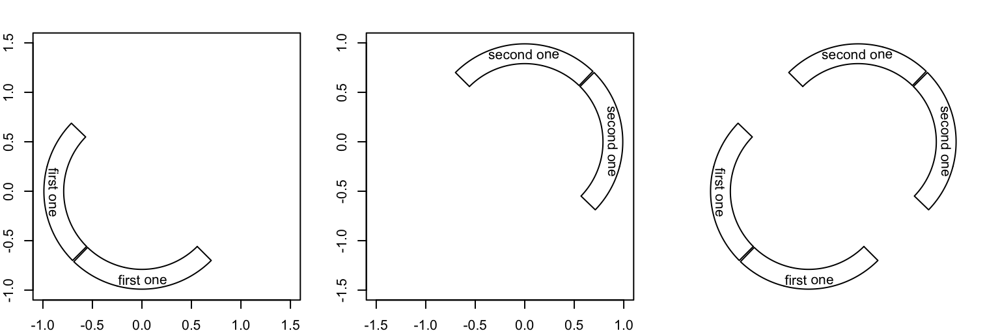

# Advanced layout {#advanced-layout}

## Zooming of sectors {#zooming-of-sectors}

In this section, we will introduce how to zoom sectors and put the zoomed sectors
at the same track as the original sectors.

Under the default settings, width of sectors are calculated according to the
data range in corresponding categories. Normally it is not a good idea to
manually modify the default sector width since it reflects useful information
of your data. However, sometimes manually modifying the width of sectors can
make more advanced plots, e.g. zoomings.

The basic idea for zooming is to put original sectors on part of the circle and
put the zoomed sectors on the other part, so that in the original sectors, widths
are still proportional to their data ranges, and in the zoomed sectors, the
widths are also proportional to the data ranges in the zoomed sectors.

This type of zooming is rather simple to implement. All we need to do is to
copy the data which corresponds to the zoomed sectors, assign new category names
to them and append to the original data. The good thing is since the data in
the zoomed sectors is exactly the same as the original sectors, if you treat them
as normal categories, the graphics will be exactly the same as in the original
sectors, but with x direction zoomed.

Following example shows more clearly the basic idea of this "horizontal"
zooming.

We first generate a data frame with six categories.


```r
set.seed(123)
df = data.frame(
    factors = sample(letters[1:6], 400, replace = TRUE),
    x = rnorm(400),
    y = rnorm(400),
    stringsAsFactors = FALSE
)
```

We want to zoom sector a and the first 10 points in sector b. First we extract
these data and format as a new data frame.


```r
zoom_df_a = df[df$factors == "a", ]
zoom_df_b = df[df$factors == "b", ]
zoom_df_b = zoom_df_b[order(zoom_df_b[, 2])[1:10], ]
zoom_df = rbind(zoom_df_a, zoom_df_b)
```

Then we need to change the sector names in the zoomed data frame. Here we just simply
add "zoom_" prefix to the original names to show that they are "zoomed" sectors. After
that, it is attached to the original data frame.


```r
zoom_df$factors = paste0("zoom_", zoom_df$factors)
df2 = rbind(df, zoom_df)
```

In this example, we will put the original cells in the left half of the circle
and the zoomed sectors in the right. As we have already mentioned before, we
simply normalize the width of normal sectors and normalize the width of zoomed
sectors separately. Note now the sum of the sector width for the original sectors
is 1 and the sum of sector width for the zoomed sectors is 1, which means
these two types of sectors have their own half circle.

You may notice the sum of the `sector.width` is not idential to 1. This is
fine, they will be further normalized to 1 internally.

Strictly speaking, since the gaps between sectors are not taken into
consideration, the width of the original sectors are not exactly 180 degree,
but the real value is quite close to it.


```r
xrange = tapply(df2$x, df2$factors, function(x) max(x) - min(x))
normal_sector_index = unique(df$factors)
zoomed_sector_index = unique(zoom_df$factors)
sector.width = c(xrange[normal_sector_index] / sum(xrange[normal_sector_index]), 
                 xrange[zoomed_sector_index] / sum(xrange[zoomed_sector_index]))
sector.width
```

```
##         c         f         b         e         d         a    zoom_a    zoom_b 
## 0.1774352 0.1649639 0.1685275 0.1662047 0.1668505 0.1560182 0.7237996 0.2762004
```

What to do next is just to make the circular plot in the normal way. All the
graphics in sector a and b will be automatically zoomed to sector "zoom_a"
and "zoom_b".

In following code, since the sector names are added outside the first track, 
`points.overflow.warning` is set to `FALSE` to turn off the warning messages.


```r
circos.par(start.degree = 90, points.overflow.warning = FALSE)
circos.initialize(df2$factors, x = df2$x, sector.width = sector.width)
circos.track(df2$factors, x = df2$x, y = df2$y, 
    panel.fun = function(x, y) {
    circos.points(x, y, col = "red", pch = 16, cex = 0.5)
    circos.text(CELL_META$xcenter, CELL_META$cell.ylim[2] + uy(2, "mm"), 
        CELL_META$sector.index, niceFacing = TRUE)
})
```

Adding links from original sectors to zoomed sectors is a good idea to show
where the zooming occurs (Figure \@ref(fig:circlize-zoom)). Notice that
we manually adjust the position of one end of the sector b link.


```r
circos.link("a", get.cell.meta.data("cell.xlim", sector.index = "a"),
    "zoom_a", get.cell.meta.data("cell.xlim", sector.index = "zoom_a"),
    border = NA, col = "#00000020")
circos.link("b", c(zoom_df_b[1, 2], zoom_df_b[10, 2]),
    "zoom_b", get.cell.meta.data("cell.xlim", sector.index = "zoom_b"),
    rou1 = get.cell.meta.data("cell.top.radius", sector.index = "b"),
    border = NA, col = "#00000020")
circos.clear()
```

<div class="figure" style="text-align: center">

<p class="caption">(\#fig:circlize-zoom)Zoom sectors.</p>
</div>

Chapter \@ref(nested-zooming) introduces another type of zooming by combining two circular plots.

## Visualize part of the circle {#part-circle}

`canvas.xlim` and `canvas.ylim` parameters in `circos.par()` are useful to
generate plots only in part of the circle. As mentioned in previews chapters,
the circular plot is always drawn in a canvas where x values range from -1 to
1 and y values range from -1 to 1. Thus, if `canvas.xlim` and `canvas.ylim`
are all set to `c(0, 1)`, which means, the canvas is restricted to the right
top part, then only sectors between 0 to 90 degree are visible
(Figure \@ref(fig:circlize-part)).


<div class="figure" style="text-align: center">

<p class="caption">(\#fig:circlize-part)One quarter of the circle.</p>
</div>

To make the right plot in Figure \@ref(fig:circlize-part), we only need to set
one sector in the layout and set `gap.after` to 270. (One sector with
`gap.after` of 270 degree means the width of this sector is exactly 90
degree.)


```r
circos.par("canvas.xlim" = c(0, 1), "canvas.ylim" = c(0, 1),
    "start.degree" = 90, "gap.after" = 270)
factors = "a" # this is the name of your sector
circos.initialize(factors = factors, xlim = ...)
...
```

Similar idea can be applied to the circle where in some tracks, 
only a subset of cells are needed. Gererally there are two ways.
The first way is to create the track and add graphics with subset of data that
only corresponds to the cells that are needed. And the second way
is to create an empty track first and customize the cells by `circos.update()`.
Following code illustrates the two methods (Figure \@ref(fig:circlize-part2)).


```r
factors = letters[1:4]
circos.initialize(factors = factors, xlim = c(0, 1))

# directly specify the subset of data
df = data.frame(factors = rep("a", 100),
                x = runif(100),
                y = runif(100))
circos.track(df$factors, x = df$x, y = df$y, 
    panel.fun = function(x, y) {
        circos.points(x, y, pch = 16, cex = 0.5)
})

# create empty track first then fill graphics in the cell
circos.track(ylim = range(df$y), bg.border = NA)
circos.update(sector.index = "a", bg.border = "black")
circos.points(df$x, df$y, pch = 16, cex = 0.5)

circos.track(factors = factors, ylim = c(0, 1))
circos.track(factors = factors, ylim = c(0, 1))
```

<div class="figure" style="text-align: center">

<p class="caption">(\#fig:circlize-part2)Show subset of cells in tracks.</p>
</div>

```r
circos.clear()
```

## Combine multiple circular plots {#combine-circular-plots}

**circlize** finally makes the circular plot in the base R graphic system.
Seperated circular plots actually can be put in a same page by some tricks
from the base graphic system. Here the key is `par(new = TRUE)` which allows
to draw a new figure as a new layer directly on the previous canvas region. By
setting different `canvas.xlim` and `canvas.ylim`, it allows to make more
complex plots which include more than one circular plots.

Folowing code shows how the two independent circualr plots are added and
nested. Figure \@ref(fig:circlize-nested) illustrates the invisible canvas
coordinate and how the two circular plots overlap.


```r
factors = letters[1:4]
circos.initialize(factors = factors, xlim = c(0, 1))
circos.track(ylim = c(0, 1), panel.fun = function(x, y) {
    circos.text(0.5, 0.5, "outer circos", niceFacing = TRUE)
})
circos.clear()

par(new = TRUE) # <- magic
circos.par("canvas.xlim" = c(-2, 2), "canvas.ylim" = c(-2, 2))
factors = letters[1:3]
circos.initialize(factors = factors, xlim = c(0, 1))
circos.track(ylim = c(0, 1), panel.fun = function(x, y) {
    circos.text(0.5, 0.5, "inner circos", niceFacing = TRUE)
})
circos.clear()
```

<div class="figure" style="text-align: center">

<p class="caption">(\#fig:circlize-nested)Nested circular plots.</p>
</div>

The second example (Figure \@ref(fig:circlize-separated)) makes a plot where
two circular plots separate from each other. You can use technique introduced
in Section \@ref(part-circle) to only show part of the circle, select proper
`canvas.xlim` and `canvas.ylim`, and finally arrange the two plots into one
page. The source code for generating Figure \@ref(fig:circlize-separated) is
at https://github.com/jokergoo/circlize_book/blob/master/src/intro-20-separated.R.

<div class="figure" style="text-align: center">

<p class="caption">(\#fig:circlize-separated)Two separated circular plots</p>
</div>

The third example is to draw cells with different radius (Figure \@ref(fig:circlize-diff-radius)). 
In fact, it makes four circular plots where only one
sector for each plot is plotted. 


```r
factors = letters[1:4]
lim = c(1, 1.1, 1.2, 1.3)
for(i in 1:4) {
    circos.par("canvas.xlim" = c(-lim[i], lim[i]), 
        "canvas.ylim" = c(-lim[i], lim[i]), 
        "track.height" = 0.4)
    circos.initialize(factors = factors, xlim = c(0, 1))
    circos.track(ylim = c(0, 1), bg.border = NA)
    circos.update(sector.index = factors[i], bg.border = "black")
    circos.points(runif(10), runif(10), pch = 16)
    circos.clear()
    par(new = TRUE)
}
par(new = FALSE)
```

<div class="figure" style="text-align: center">

<p class="caption">(\#fig:circlize-diff-radius)Cells with differnet radius.</p>
</div>

Note above plot is different from the example in Figure \@ref(fig:circlize-part2).
In Figure \@ref(fig:circlize-part2), cells both visible and invisible all belong to
a same track and they are in a same circular plot, thus they should have same
radius. But for the example here, cells have different radius and they belong
to different circular plot.

In chapter \@ref(nested-zooming), we use this technique to implement zoomings by combining two circular plots.


## Arrange multiple plots {#arrange-multiple-plots}

**circlize** is implemented in the base R graphic system, thus, you can use
`layout()` or `par(mforw, mfcol)` to arrange multiple circular plots in one page
(Figure \@ref(fig:circlize-multiple-layout)).


```r
layout(matrix(1:9, 3, 3))
for(i in 1:9) {
    factors = 1:8
    par(mar = c(0.5, 0.5, 0.5, 0.5))
    circos.par(cell.padding = c(0, 0, 0, 0))
    circos.initialize(factors, xlim = c(0, 1))
    circos.track(ylim = c(0, 1), track.height = 0.05,
        bg.col = rand_color(8), bg.border = NA)
    for(i in 1:20) {
        se = sample(1:8, 2)
        circos.link(se[1], runif(2), se[2], runif(2), 
            col = rand_color(1, transparency = 0.4), border = NA)
    }
    circos.clear()
}
```

<div class="figure" style="text-align: center">

<p class="caption">(\#fig:circlize-multiple-layout)Arrange multiple circular plots.</p>
</div>

