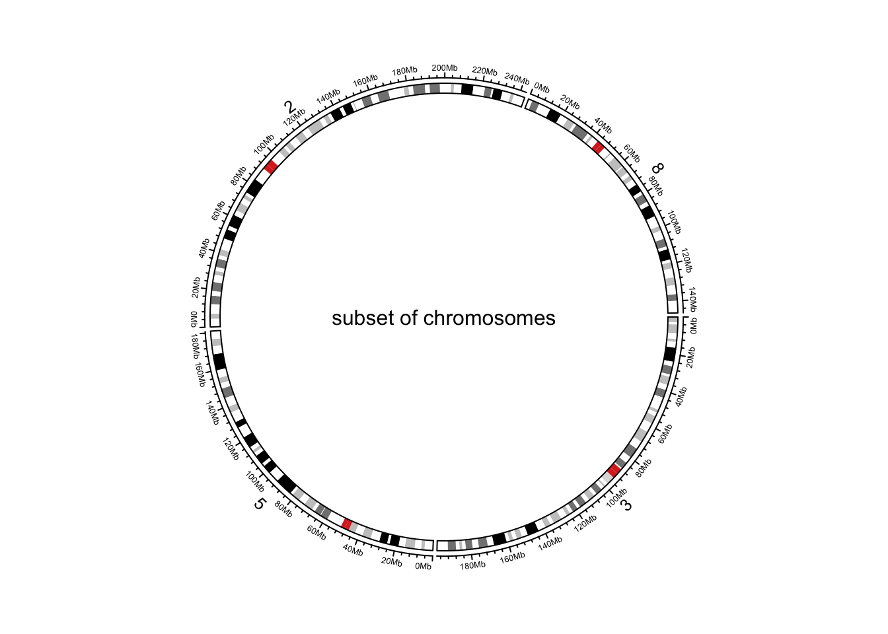
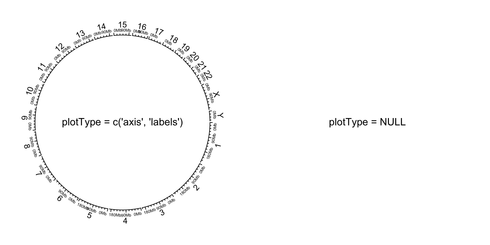
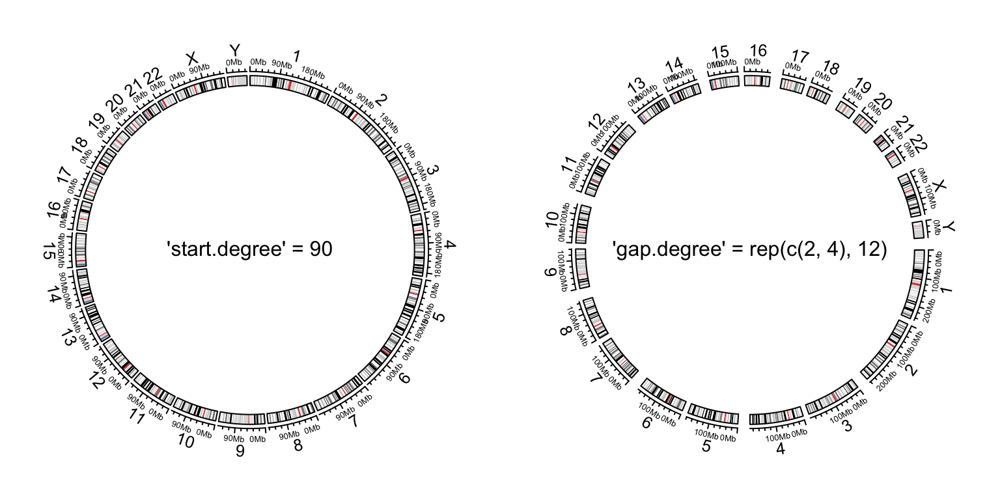
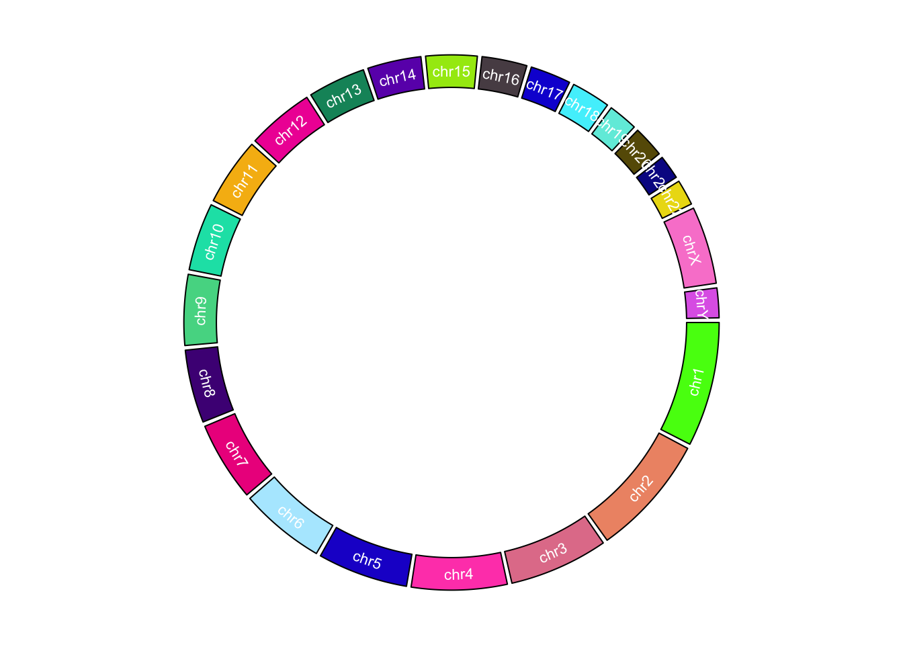
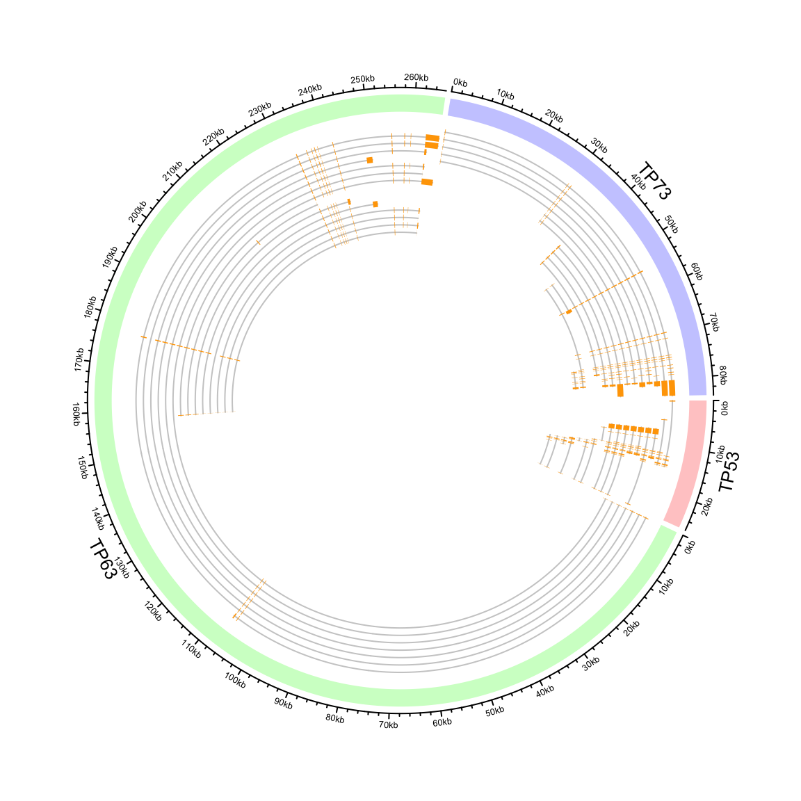
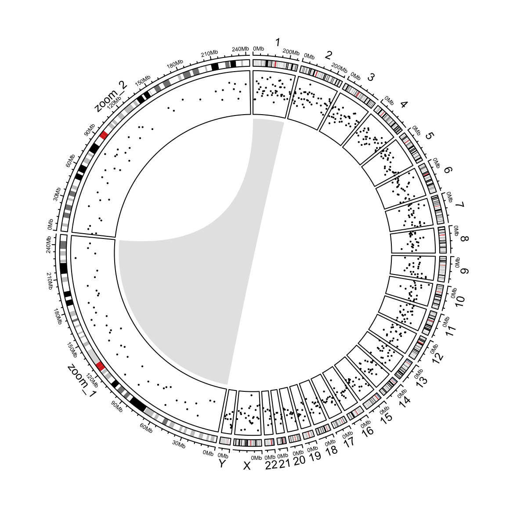
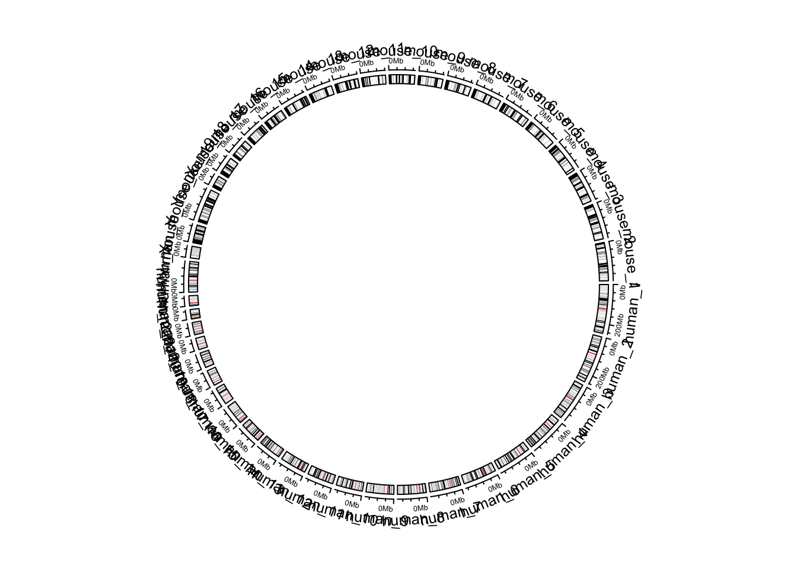
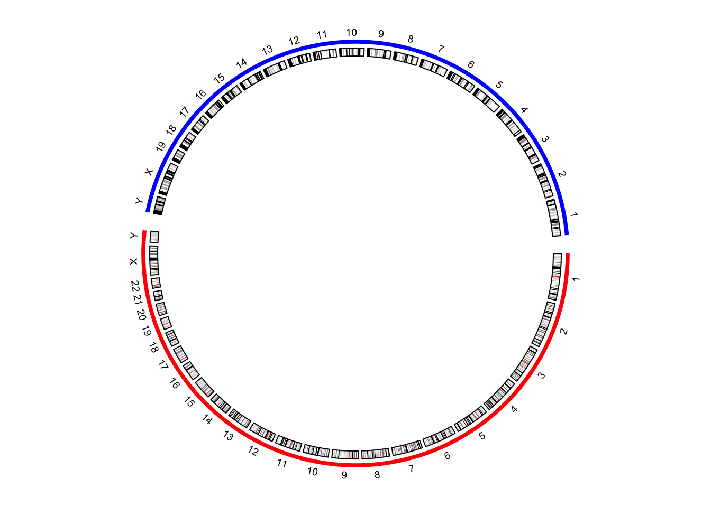
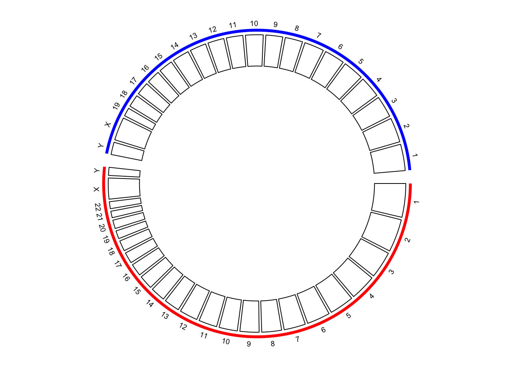
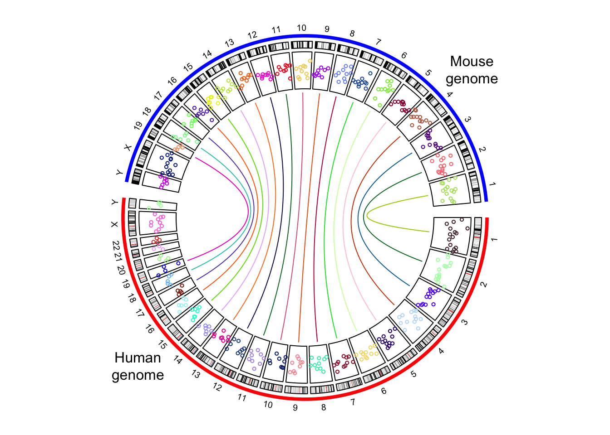

# Initialize with genomic data {#initialize-genomic-plot}

**circlize** is quite flexible to initialize the circular plot
not only by chromosomes, but also by any type of general genomic categories.

## Initialize with cytoband data {#initialize-cytoband}

[Cytoband data](https://genome.ucsc.edu/cgi-bin/hgTables?hgta_table=cytoBand&hgta_doSchema=describe%20table%20schema) is
an ideal data source to initialize genomic plots. It contains length of
chromosomes as well as so called "chromosome band" annotation to help to
identify positions on chromosomes.

### Basic usage

If you work on human genome, the most straightforward way is to directly use
`circos.initializeWithIdeogram()` (Figure \@ref(fig:genomic-initialize-ideogram-default)). 
By default, the function creates a track with chromosome name
and axes, and a track of ideograms.

Although chromosome names added to the plot are pure numeric, actually the
internally names have the "chr" index. When you adding more tracks, the
chromosome names should also have "chr" index.


```r
circos.initializeWithIdeogram()
text(0, 0, "default", cex = 1)
```

<div class="figure" style="text-align: center">

<p class="caption">(\#fig:genomic-initialize-ideogram-default)Initialize genomic plot, default.</p>
</div>

```r
circos.info()
```

```
## All your sectors:
##  [1] "chr1"  "chr2"  "chr3"  "chr4"  "chr5"  "chr6"  "chr7"  "chr8"  "chr9" 
## [10] "chr10" "chr11" "chr12" "chr13" "chr14" "chr15" "chr16" "chr17" "chr18"
## [19] "chr19" "chr20" "chr21" "chr22" "chrX"  "chrY" 
## 
## All your tracks:
## [1] 1 2
## 
## Your current sector.index is chrY
## Your current track.index is 2
```

```r
circos.clear()
```

By default, `circos.initializeWithIdeogram()` initializes the plot with
cytoband data of human genome `hg19`. Users can also initialize with other
species by specifying `species` argument and it will automatically download
cytoband files for corresponding species.


```r
circos.initializeWithIdeogram(species = "hg18")
circos.initializeWithIdeogram(species = "mm10")
```

When you are dealing rare species and there is no cytoband data available yet,
`circos.initializeWithIdeogram()` will try to continue to download the
"chromInfo" file form UCSC, which also contains lengths of chromosomes, but of
course, there is no ideogram track on the plot.

In some cases, when there is no internet connection for downloading or there is 
no corresponding data avaiable on UCSC yet. You can manually construct a data frame
which contains ranges of chromosomes or a file path if it is stored in a file,
and sent to `circos.initializeWithIdeogram()`.


```r
cytoband.file = system.file(package = "circlize", "extdata", "cytoBand.txt")
circos.initializeWithIdeogram(cytoband.file)

cytoband.df = read.table(cytoband.file, colClasses = c("character", "numeric",
    "numeric", "character", "character"), sep = "\t")
circos.initializeWithIdeogram(cytoband.df)
```

If you read cytoband data directly from file, please explicitly specify
`colClasses` arguments and set the class of position columns as `numeric`. The
reason is since positions are represented as integers, `read.table` would
treat those numbers as `integer` by default. In initialization of circular
plot, **circlize** needs to calculate the summation of all chromosome lengths.
The summation of such large integers would throw error of integer overflow.

By default, `circos.intializeWithIdeogram()` uses all chromosomes which are
available in cytoband data to initialize the circular plot. Users can
choose a subset of chromosomes by specifying `chromosome.index`. This
argument is also for ordering chromosomes (Figure \@ref(fig:genomic-initialize-ideogram-subset)).


```r
circos.initializeWithIdeogram(chromosome.index = paste0("chr", c(3,5,2,8)))
text(0, 0, "subset of chromosomes", cex = 1)
```

<div class="figure" style="text-align: center">

<p class="caption">(\#fig:genomic-initialize-ideogram-subset)Initialize genomic plot, subset chromosomes.</p>
</div>

```r
circos.clear()
```

When there is no cytoband data for the specified species, and when chromInfo data
is used instead, there may be many many extra short contigs. `chromosome.index`
can also be useful to remove unnecessary contigs.

### Pre-defined tracks

After the initialization of the circular plot,
`circos.initializeWithIdeogram()` additionally creates a track where there are
genomic axes and chromosome names, and create another track where there is an
ideogram (depends on whether cytoband data is available). `plotType` argument
is used to control which type of tracks to add. (figure Figure \@ref(fig:genomic-initialize-ideogram-track)).


```r
circos.initializeWithIdeogram(plotType = c("axis", "labels"))
text(0, 0, "plotType = c('axis', 'labels')", cex = 1)
circos.clear()

circos.initializeWithIdeogram(plotType = NULL)
text(0, 0, "plotType = NULL", cex = 1)
```

<div class="figure" style="text-align: center">

<p class="caption">(\#fig:genomic-initialize-ideogram-track)Initialize genomic plot, control tracks.</p>
</div>

```r
circos.clear()
```

### Other general settings

Similar as general circular plot, the parameters for the layout can be
controlled by `circos.par()` (Figure \@ref(fig:genomic-initialize-ideogram-par)).
Do remember when you explicitly set `circos.par()`, you need to call `circos.clear()`
to finish the plotting.


```r
circos.par("start.degree" = 90)
circos.initializeWithIdeogram()
circos.clear()
text(0, 0, "'start.degree' = 90", cex = 1)

circos.par("gap.degree" = rep(c(2, 4), 12))
circos.initializeWithIdeogram()
circos.clear()
text(0, 0, "'gap.degree' = rep(c(2, 4), 12)", cex = 1)
```

<div class="figure" style="text-align: center">

<p class="caption">(\#fig:genomic-initialize-ideogram-par)Initialize genomic plot, control layout.</p>
</div>

## Customize chromosome track

By default `circos.initializeWithIdeogram()` initializes the layout and adds
two tracks. When `plotType` argument is set to `NULL`, the circular layout is
only initialized but nothing is added. This makes it possible for users to
completely design their own style of chromosome track.

In the following example, we use different colors to represent chromosomes and
put chromosome names in the center of each cell (Figure \@ref(fig:genomic-customize-chromosome)).


```r
set.seed(123)
circos.initializeWithIdeogram(plotType = NULL)
circos.track(ylim = c(0, 1), panel.fun = function(x, y) {
    chr = CELL_META$sector.index
    xlim = CELL_META$xlim
    ylim = CELL_META$ylim
    circos.rect(xlim[1], 0, xlim[2], 1, col = rand_color(1))
    circos.text(mean(xlim), mean(ylim), chr, cex = 0.7, col = "white",
        facing = "inside", niceFacing = TRUE)
}, track.height = 0.15, bg.border = NA)
```

<div class="figure" style="text-align: center">

<p class="caption">(\#fig:genomic-customize-chromosome)Customize chromosome track.</p>
</div>

```r
circos.clear()
```

## Initialize with general genomic category

Chromosome is just a special case of genomic category.
`circos.genomicInitialize()` can initialize circular layout with any type of
genomic categories. In fact, `circos.initializeWithIdeogram()` is implemented
by `circos.genomicInitialize()`. The input data for
`circos.genomicInitialize()` is also a data frame with at least three columns.
The first column is genomic category (for cytoband data, it is chromosome
name), and the next two columns are positions in each genomic category. The
range in each category will be inferred as the minimum position and the
maximum position in corresponding category. 

In the following example, a circular plot is initialized with three genes.


```r
df = data.frame(
    name  = c("TP53",  "TP63",    "TP73"),
    start = c(7565097, 189349205, 3569084),
    end   = c(7590856, 189615068, 3652765))
circos.genomicInitialize(df)
```

Note it is not necessary that the record for each gene is only one row.

In following example, we plot the transcripts for TP53, TP63 and TP73 in a
circular layout (Figure \@ref(fig:genomic-gene-model)).


```r
tp_family = readRDS(system.file(package = "circlize", "extdata", "tp_family_df.rds"))
head(tp_family)
```

```
##   gene   start     end        transcript exon
## 1 TP53 7565097 7565332 ENST00000413465.2    7
## 2 TP53 7577499 7577608 ENST00000413465.2    6
## 3 TP53 7578177 7578289 ENST00000413465.2    5
## 4 TP53 7578371 7578554 ENST00000413465.2    4
## 5 TP53 7579312 7579590 ENST00000413465.2    3
## 6 TP53 7579700 7579721 ENST00000413465.2    2
```

In the following code, we first create a track which identifies three genes.


```r
circos.genomicInitialize(tp_family)
circos.track(ylim = c(0, 1), 
    bg.col = c("#FF000040", "#00FF0040", "#0000FF40"), 
    bg.border = NA, track.height = 0.05)
```

Next, we put transcripts one after the other for each gene. It is simply to
add lines and rectangles. The usage of `circos.genomicTrack()` and
`circos.genomicRect()` will be discussed in Chapter \@ref(genomic-plotting-region).


```r
n = max(tapply(tp_family$transcript, tp_family$gene, function(x) length(unique(x))))
circos.genomicTrack(tp_family, ylim = c(0.5, n + 0.5), 
    panel.fun = function(region, value, ...) {
        all_tx = unique(value$transcript)
        for(i in seq_along(all_tx)) {
            l = value$transcript == all_tx[i]
            # for each transcript
            current_tx_start = min(region[l, 1])
            current_tx_end = max(region[l, 2])
            circos.lines(c(current_tx_start, current_tx_end), 
                c(n - i + 1, n - i + 1), col = "#CCCCCC")
            circos.genomicRect(region[l, , drop = FALSE], ytop = n - i + 1 + 0.4, 
                ybottom = n - i + 1 - 0.4, col = "orange", border = NA)
        }
}, bg.border = NA, track.height = 0.4)
circos.clear()
```

<div class="figure" style="text-align: center">

<p class="caption">(\#fig:genomic-gene-model)Circular representation of alternative transcripts for genes.</p>
</div>

In Figure \@ref(fig:genomic-gene-model), you may notice the start of axes
becomes "0KB" while not the original values. It is just an adjustment of the
axes labels to reflect the relative distance to the start of each gene, while
the coordinate in the cells are still using the original values. Set
`tickLabelsStartFromZero` to `FALSE` to recover axes labels to the original
values.

## Zooming chromosomes

The strategy is the same as introduced in Section \@ref(zooming-of-sectors).
We first define a function `extend_chromosomes()` which copy data in subset of
chromosomes into the original data frame.


```r
extend_chromosomes = function(bed, chromosome, prefix = "zoom_") {
    zoom_bed = bed[bed[[1]] %in% chromosome, , drop = FALSE]
    zoom_bed[[1]] = paste0(prefix, zoom_bed[[1]])
    rbind(bed, zoom_bed)
}
```

We use `read.cytoband()` to download and read cytoband data from UCSC. In following,
x ranges for normal chromosomes and zoomed chromosomes are normalized separetely.


```r
cytoband = read.cytoband()
cytoband_df = cytoband$df
chromosome = cytoband$chromosome

xrange = c(cytoband$chr.len, cytoband$chr.len[c("chr1", "chr2")])
normal_chr_index = 1:24
zoomed_chr_index = 25:26

# normalize in normal chromsomes and zoomed chromosomes separately
sector.width = c(xrange[normal_chr_index] / sum(xrange[normal_chr_index]), 
                 xrange[zoomed_chr_index] / sum(xrange[zoomed_chr_index])) 
```

The extended cytoband data which is in form of a data frame is sent to
`circos.initializeWithIdeogram()`. You can see the ideograms for chromosome 1
and 2 are zoomed (Figure \@ref(fig:genomic-zoom)).


```r
circos.par(start.degree = 90)
circos.initializeWithIdeogram(extend_chromosomes(cytoband_df, c("chr1", "chr2")), 
    sector.width = sector.width)
```

Add a new track.


```r
bed = generateRandomBed(500)
circos.genomicTrack(extend_chromosomes(bed, c("chr1", "chr2")),
    panel.fun = function(region, value, ...) {
        circos.genomicPoints(region, value, pch = 16, cex = 0.3)
})
```

Add a link from original chromosome to the zoomed chromosome (Figure \@ref(fig:genomic-zoom)).


```r
circos.link("chr1", get.cell.meta.data("cell.xlim", sector.index = "chr1"),
    "zoom_chr1", get.cell.meta.data("cell.xlim", sector.index = "zoom_chr1"),
    col = "#00000020", border = NA)
circos.clear()
```

<div class="figure" style="text-align: center">

<p class="caption">(\#fig:genomic-zoom)Zoom chromosomes.</p>
</div>

## Concatenating two genomes

There are some scenarios where users want to visualize more than one genomes
in the circular plots. This can be done by making "a combined genome". In the
following example, I combine both human and mouse genomes.


```r
human_cytoband = read.cytoband(species = "hg19")$df
mouse_cytoband = read.cytoband(species = "mm10")$df
```

One thing important is since the two genome will be combined, the chromosome
names for each genome need to be adjusted. Here I simply add `human_`/`mouse_`
prefix.


```r
human_cytoband[ ,1] = paste0("human_", human_cytoband[, 1])
mouse_cytoband[ ,1] = paste0("mouse_", mouse_cytoband[, 1])
```

Now I can combine the two cytoband data frames into one.


```r
cytoband = rbind(human_cytoband, mouse_cytoband)
head(cytoband)
```

```
##           V1       V2       V3     V4     V5
## 1 human_chr1        0  2300000 p36.33   gneg
## 2 human_chr1  2300000  5400000 p36.32 gpos25
## 3 human_chr1  5400000  7200000 p36.31   gneg
## 4 human_chr1  7200000  9200000 p36.23 gpos25
## 5 human_chr1  9200000 12700000 p36.22   gneg
## 6 human_chr1 12700000 16200000 p36.21 gpos50
```

The combined `cytoband` is still a valid cytoband data frame, thus, the ideograms
can be drawn for the combined genome. Also when I construct the variable `chromosome.index`,
I let human chromosome 1 to be close to mouse chromosome 1 (Figure \@ref(fig:genomic-combined-default).


```r
chromosome.index = c(paste0("human_chr", c(1:22, "X", "Y")), 
                     rev(paste0("mouse_chr", c(1:19, "X", "Y"))))
circos.initializeWithIdeogram(cytoband, chromosome.index = chromosome.index)
```

<div class="figure" style="text-align: center">

<p class="caption">(\#fig:genomic-combined-default)Default style of two combined genomes.</p>
</div>

```r
circos.clear()
```

By default, in the plot there are chromosome names, axes and ideograms. Now
for the combined genome, since there are quite a lot of chromosomes, each
chromosome will be very short in the plot, which makes it not easy to read the
axes and the long chromosome names. In the following improved code, I turn off
the chromosome name and the axes. We create a small track to discriminate
human chromosomes and mouse chromosomes (by `highlight.chromosome()`) and I
only write the numeric indices (also `X` and `Y`) for chromosomes. A gap of 5
degrees is set between human and mouse chromosomes (by
`circos.par("gap.after")`) (Figure \@ref(fig:genomic-combined-improved).


```r
circos.par(gap.after = c(rep(1, 23), 5, rep(1, 20), 5))
circos.initializeWithIdeogram(cytoband, plotType = NULL, 
    chromosome.index = chromosome.index)
circos.track(ylim = c(0, 1), panel.fun = function(x, y) {
    circos.text(CELL_META$xcenter, CELL_META$ylim[2] + mm_y(2), 
        gsub(".*chr", "", CELL_META$sector.index), cex = 0.6, niceFacing = TRUE)
}, track.height = mm_h(1), cell.padding = c(0, 0, 0, 0), bg.border = NA)
highlight.chromosome(paste0("human_chr", c(1:22, "X", "Y")), 
    col = "red", track.index = 1)
highlight.chromosome(paste0("mouse_chr", c(1:19, "X", "Y")), 
    col = "blue", track.index = 1)

circos.genomicIdeogram(cytoband)
```

<div class="figure" style="text-align: center">

<p class="caption">(\#fig:genomic-combined-improved)Improved visualization of the combined genome.</p>
</div>

```r
circos.clear()
```

In previous example, I demonstrate to create the circular layout for the
combined genome with the cytoband data frames. The layout can also be created
only by the chromosome ranges, i.e., the length of each chromosome. In the
following code, `read.chromInfo()` can fetch the chromosome range for a
specific genome.


```r
human_chromInfo = read.chromInfo(species = "hg19")$df
mouse_chromInfo = read.chromInfo(species = "mm10")$df
human_chromInfo[ ,1] = paste0("human_", human_chromInfo[, 1])
mouse_chromInfo[ ,1] = paste0("mouse_", mouse_chromInfo[, 1])
chromInfo = rbind(human_chromInfo, mouse_chromInfo)
# note the levels of the factor controls the chromosome orders in the plot
chromInfo[, 1] = factor(chromInfo[ ,1], levels = chromosome.index)
head(chromInfo)
```

```
##          chr start       end
## 1 human_chr1     0 249250621
## 2 human_chr2     0 243199373
## 3 human_chr3     0 198022430
## 4 human_chr4     0 191154276
## 5 human_chr5     0 180915260
## 6 human_chr6     0 171115067
```

With the specified chromosome ranges, `circos.genomicInitialize()` is used to initialize the 
layout (Figure \@ref(fig:genomic-combined-genomic-initialize).


```r
circos.par(gap.after = c(rep(1, 23), 5, rep(1, 20), 5))
circos.genomicInitialize(chromInfo, plotType = NULL)
circos.track(ylim = c(0, 1), panel.fun = function(x, y) {
    circos.text(CELL_META$xcenter, CELL_META$ylim[2] + mm_y(2), 
        gsub(".*chr", "", CELL_META$sector.index), cex = 0.6, niceFacing = TRUE)
}, track.height = mm_h(1), cell.padding = c(0, 0, 0, 0), bg.border = NA)
highlight.chromosome(paste0("human_chr", c(1:22, "X", "Y")), 
    col = "red", track.index = 1)
highlight.chromosome(paste0("mouse_chr", c(1:19, "X", "Y")), 
    col = "blue", track.index = 1)

circos.track(ylim = c(0, 1))
```

<div class="figure" style="text-align: center">

<p class="caption">(\#fig:genomic-combined-genomic-initialize)Initialize the plot with chromosome ranges.</p>
</div>

```r
circos.clear()
```

Adding more tracks has no difference to the single-genome plots. The only thing
to note is the chromosome names should be properly formatted. In the following
code, I create a track of points and add links between human and mouse genomes 
(Figure \@ref(fig:genomic-combined-more-tracks).


```r
circos.par(gap.after = c(rep(1, 23), 5, rep(1, 20), 5))
circos.genomicInitialize(chromInfo, plotType = NULL)
circos.track(ylim = c(0, 1), panel.fun = function(x, y) {
    circos.text(CELL_META$xcenter, CELL_META$ylim[2] + mm_y(2), 
        gsub(".*chr", "", CELL_META$sector.index), cex = 0.6, niceFacing = TRUE)
}, track.height = mm_h(1), cell.padding = c(0, 0, 0, 0), bg.border = NA)
highlight.chromosome(paste0("human_chr", c(1:22, "X", "Y")), 
    col = "red", track.index = 1)
highlight.chromosome(paste0("mouse_chr", c(1:19, "X", "Y")), 
    col = "blue", track.index = 1)

circos.genomicIdeogram(cytoband)

# a track of points
human_df = generateRandomBed(200, species = "hg19")
mouse_df = generateRandomBed(200, species = "mm10")
human_df[ ,1] = paste0("human_", human_df[, 1])
mouse_df[ ,1] = paste0("mouse_", mouse_df[, 1])
df = rbind(human_df, mouse_df)
circos.genomicTrack(df, panel.fun = function(region, value, ...) {
    circos.genomicPoints(region, value, col = rand_color(1), cex = 0.5, ...)
})

# links between human and mouse genomes
human_mid = data.frame(
    chr = paste0("human_chr", 1:19),
    mid = round((human_chromInfo[1:19, 2] + human_chromInfo[1:19, 3])/2)
)
mouse_mid = data.frame(
    chr = paste0("mouse_chr", 1:19),
    mid = round((mouse_chromInfo[1:19, 2] + mouse_chromInfo[1:19, 3])/2)
)
circos.genomicLink(human_mid, mouse_mid, col = rand_color(19))
circos.clear()
text(-0.9, -0.8, "Human\ngenome")
text(0.9, 0.8, "Mouse\ngenome")
```

<div class="figure" style="text-align: center">

<p class="caption">(\#fig:genomic-combined-more-tracks)The combined genome with more tracks.</p>
</div>
