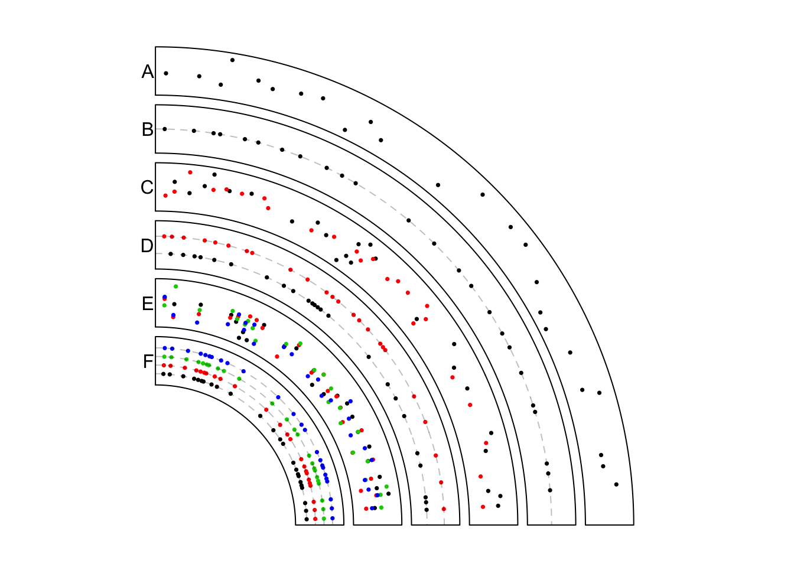
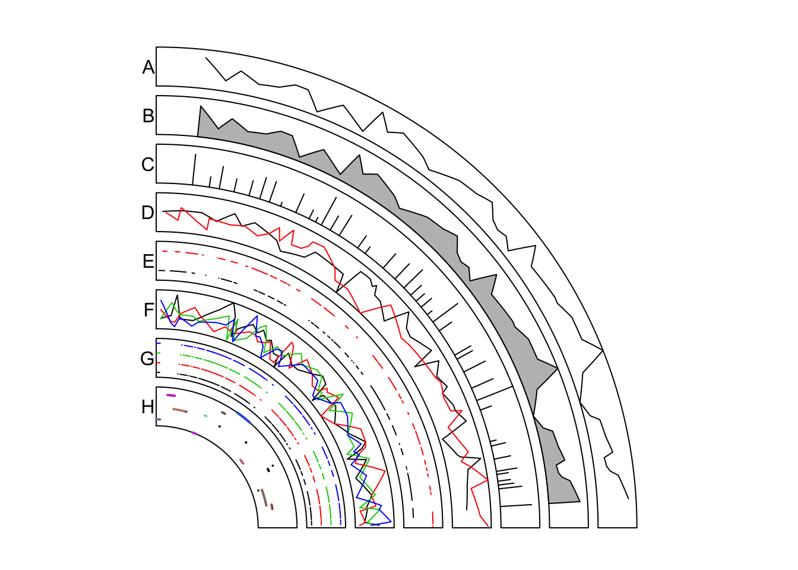

# modes for `circos.genomicTrack()` {#modes-of-input}

The behaviour of `circos.genomicTrack()` and `panel.fun` will be different
according to different input data (e.g. is it a simple data frame or a list of
data frames? If it is a data frame, how many numeric columns it has?) and
different settings.

## Normal mode

### Input is a data frame

If input `data` is a data frame in _BED_ format, `region` in `panel.fun` would
be a data frame containing start position and end position in the current
chromosome which is extracted from `data`. `value` is also a data frame
which contains columns in `data` excluding the first three columns. Index of
proper numeric columns will be passed by `...` if it is set in
`circos.genomicTrack()`. If users want to use such information, they need to
pass `...` to low-level genomic function such as `circos.genoimcPoints()` as
well.

If there are more than one numeric columns, graphics are added for each column
repeatedly (with same genomic positions).


```r
data = generateRandomBed(nc = 2)
circos.genomicTrack(data, numeric.column = 4, 
    panel.fun = function(region, value, ...) {
        circos.genomicPoints(region, value, ...)
        circos.genomicPoints(region, value)
        # 1st column in `value` while 4th column in `data`
        circos.genomicPoints(region, value, numeric.column = 1)
})
```

### Input is a list of data frames

If input data is a list of data frames, `panel.fun` is applied on each
data frame iteratively to the current cell. Under such condition, `region` and `value`
will contain corresponding data in the current data frame and in the current chromosome. The index for the
current data frame can be get by `getI(...)`. Note `getI(...)` can only be used
inside `panel.fun` and `...` argument is mandatory.

When `numeric.column` is specified in `circos.genomicTrack()`, the length of
`numeric.column` can only be one or the number of data frames, which means,
there is only one numeric column that will be used in each data frame. If it
is not specified, the first numeric column in each data frame is used.


```r
bed_list = list(generateRandomBed(), generateRandomBed())
circos.genomicTrack(bed_list,
    panel.fun = function(region, value, ...) {
        i = getI(...)
        circos.genomicPoints(region, value, col = i, ...)
})

# column 4 in the first bed and column 5 in the second bed
circos.genomicTrack(bed_list, numeric.column = c(4, 5),
    panel.fun = function(region, value, ...) {
        i = getI(...)
        circos.genomicPoints(region, value, col = i, ...)
})
```

## Stack mode

`circos.genomicTrack()` also supports a `stack` mode by setting `stack =
TRUE`. Under `stack` mode, `ylim` is re-defined inside the function and the
y-axis is splitted into several bins with equal height and graphics are put
onto "horizontal" bins (with position `y = 1, 2, ...`).

### Input is a data frame

Under `stack` mode, when input data is a single data frame containing one or
more numeric columns, each numeric column defined in `numeric.column` will be
treated as a single unit (recall that when `numeric.column` is not specified,
all numeric columns are used). `ylim` is re-defined to `c(0.5, n+0.5)` in
which `n` is number of numeric columns specified. `panel.fun` is applied
iteratively on each numeric column and add graphics to the horizontal line `y = i`. 
In this case, actually `value` in e.g. `circos.genomicPoints()` doesn't
used for mapping the y positions, while replaced with `y = i` internally.

In each iteration, in `panel.fun`, `region` is still the genomic regions in
current chromosome, but `value` only contains current numeric column plus all
non-numeric columns. The value of the index of "current" numeric column can be
obtained by `getI(...)`.


```r
data = generateRandomBed(nc = 2)
circos.genomicTrack(data, stack = TRUE,
    panel.fun = function(region, value, ...) {
        i = getI(...)
        circos.genomicPoints(region, value, col = i, ...)
})
```

### Input is a list of data frames

When input data is a list of data frames, each data frame will be treated as a
single unit. `ylim` is re-defined to `c(0.5, n+0.5)` in which `n` is the
number of data frames. `panel.fun` will be applied iteratively on each data
frame. In each iteration, in `panel.fun`, `region` is still the genomic
regions in current chromosome, and `value` contains columns in current data
frame excluding the first three columns. Graphics by low-level genomic
functions will be added on the `horizontal' bins.


```r
bed_list = list(generateRandomBed(), generateRandomBed())
circos.genomicTrack(bed_list, stack = TRUE,
    panel.fun = function(region, value, ...) {
        i = getI(...)
        circos.genomicPoints(region, value, ...)
})
```

Under `stack` mode, if using a data frame with multiple numeric columns,
graphics on all horizontal bins share the same genomic positions while if
using a list of data frames, the genomic positions can be different.

## Applications

In this section, we will show several real examples of adding genomic graphics
under different modes. Again, if you are not happy with these functionalities,
you can simply re-implement your plot with the basic circlize functions.

### Points {#modes-points}

To make plots more clear to look at, we only add graphics in the first quarter
of the circle and initialize the plot only with chromosome 1.


```r
set.seed(999)
circos.par("track.height" = 0.1, start.degree = 90,
    canvas.xlim = c(0, 1), canvas.ylim = c(0, 1), gap.degree = 270)
circos.initializeWithIdeogram(chromosome.index = "chr1", plotType = NULL)
```

In the example figure (Figure \@ref(fig:genomic-application-points)) below, each track
contains points under different modes.

In track A, it is the most normal way to add points. Here `bed` only contains
one numeric column and points are added at the middle points of regions.


```r
bed = generateRandomBed(nr = 300)
circos.genomicTrack(bed, panel.fun = function(region, value, ...) {
    circos.genomicPoints(region, value, pch = 16, cex = 0.5, ...)
})
```

In track B, if it is specified as `stack` mode, points are added in a
horizontal line (or visually, a circular line).


```r
circos.genomicTrack(bed, stack = TRUE, 
    panel.fun = function(region, value, ...) {
        circos.genomicPoints(region, value, pch = 16, cex = 0.5,...)
        i = getI(...)
        circos.lines(CELL_META$cell.xlim, c(i, i), lty = 2, col = "#00000040")
})
```

In track C, the input data is a list of two data frames. `panel.fun` is applied
iterately on each data frame. The index of "current" index can be obtained by `getI(...)`.


```r
bed1 = generateRandomBed(nr = 300)
bed2 = generateRandomBed(nr = 300)
bed_list = list(bed1, bed2)
circos.genomicTrack(bed_list, 
    panel.fun = function(region, value, ...) {
        i = getI(...)
        circos.genomicPoints(region, value, pch = 16, cex = 0.5, col = i, ...)
})
```

In track D, the list of data frames is plotted under `stack` mode. Graphics
corresponding to each data frame are added to a horizontal line.


```r
circos.genomicTrack(bed_list, stack = TRUE, 
    panel.fun = function(region, value, ...) {
        i = getI(...)
        circos.genomicPoints(region, value, pch = 16, cex = 0.5, col = i, ...)
        circos.lines(CELL_META$cell.xlim, c(i, i), lty = 2, col = "#00000040")
})
```

In track E, the data frame has four numeric columns. Under normal mode, all the four
columns are used with the same genomic coordinates.


```r
bed = generateRandomBed(nr = 300, nc = 4)
circos.genomicTrack(bed, 
    panel.fun = function(region, value, ...) {
        circos.genomicPoints(region, value, pch = 16, cex = 0.5, col = 1:4, ...)
})
```

In track F, the data frame has four columns but is plotted under `stack` mode.
Graphics for each column are added to a horizontal line. Current column can be
obtained by `getI(...)`. Note here  `value` in `panel.fun` is a data frame
with only one column (which is the current numeric column).


```r
bed = generateRandomBed(nr = 300, nc = 4)
circos.genomicTrack(bed, stack = TRUE, 
    panel.fun = function(region, value, ...) {
        i = getI(...)
        circos.genomicPoints(region, value, pch = 16, cex = 0.5, col = i, ...)
        circos.lines(CELL_META$cell.xlim, c(i, i), lty = 2, col = "#00000040")
})
circos.clear()
```

<div class="figure" style="text-align: center">

<p class="caption">(\#fig:genomic-application-points)Add points under different modes.</p>
</div>

### Lines {#modes-lines}

Similar as previous figure, only the first quarter in the circle is
visualized. Examples are shown in Figure \@ref(fig:genomic-application-lines).


```r
circos.par("track.height" = 0.08, start.degree = 90,
    canvas.xlim = c(0, 1), canvas.ylim = c(0, 1), gap.degree = 270,
    cell.padding = c(0, 0, 0, 0))
circos.initializeWithIdeogram(chromosome.index = "chr1", plotType = NULL)
```

In track A, it is the most simple way to add lines. Middle points of regions
are used as the values on x-axes.


```r
bed = generateRandomBed(nr = 500)
circos.genomicTrack(bed, 
    panel.fun = function(region, value, ...) {
        circos.genomicLines(region, value)
})
```

`circos.genomicLines()` is implemented by `circos.lines()`, thus, arguments
supported in `circos.lines()` can also be in `circos.genomicLines()`. In track
B, the area under the line is filled with color and in track C, type of the
line is set to `h`.


```r
circos.genomicTrack(bed, 
    panel.fun = function(region, value, ...) {
        circos.genomicLines(region, value, area = TRUE)
})
circos.genomicTrack(bed, 
    panel.fun = function(region, value, ...) {
        circos.genomicLines(region, value, type = "h")
})
```

In track D, the input is a list of data frames. `panel.fun` is applied to each data frame
iterately.


```r
bed1 = generateRandomBed(nr = 500)
bed2 = generateRandomBed(nr = 500)
bed_list = list(bed1, bed2)
circos.genomicTrack(bed_list, 
    panel.fun = function(region, value, ...) {
        i = getI(...)
        circos.genomicLines(region, value, col = i, ...)
})
```

In track E, the input is a list of data frames and is drawn under `stack`
mode. Each genomic region is drawn as a horizontal segment and is put on a
horizontal line where the width of the segment corresponds to the width of the
genomc region. Under `stack` mode, for `circos.genomicLines()`, type of lines
is only restricted to segments.


```r
circos.genomicTrack(bed_list, stack = TRUE, 
    panel.fun = function(region, value, ...) {
        i = getI(...)
        circos.genomicLines(region, value, col = i, ...)
})
```

In track F, the input is a data frame with four numeric columns. Each column
is drawn under the normal mode where the same genomic coordinates are shared.


```r
bed = generateRandomBed(nr = 500, nc = 4)
circos.genomicTrack(bed, 
    panel.fun = function(region, value, ...) {
        circos.genomicLines(region, value, col = 1:4, ...)
})
```

In track G, the data frame with four numeric columns are drawn under `stack` mode.
All the four columns are drawn to four horizontal lines.


```r
bed = generateRandomBed(nr = 500, nc = 4)
circos.genomicTrack(bed, stack = TRUE, 
    panel.fun = function(region, value, ...) {
        i = getI(...)
        circos.genomicLines(region, value, col = i, ...)
})
```

In track H, we specify `type` to `segment` and set different colors for segments.
Note each segment is located at the y position defined in the numeric column.


```r
bed = generateRandomBed(nr = 200)
circos.genomicTrack(bed, 
    panel.fun = function(region, value, ...) {
        circos.genomicLines(region, value, type = "segment", lwd = 2, 
            col = rand_color(nrow(region)), ...)
})
circos.clear()
```

<div class="figure" style="text-align: center">

<p class="caption">(\#fig:genomic-application-lines)Add lines under different modes.</p>
</div>

### Rectangles {#modes-rectangles}

Again, only the first quarter of the circle is initialized. For rectangles,
the filled colors  are always used to represent numeric values. Here we define
a color mapping function `col_fun` to map values to colors. Examples are in
Figure \@ref(fig:genomic-application-rect).


```r
circos.par("track.height" = 0.15, start.degree = 90,
    canvas.xlim = c(0, 1), canvas.ylim = c(0, 1), gap.degree = 270)
circos.initializeWithIdeogram(chromosome.index = "chr1", plotType = NULL)
col_fun = colorRamp2(breaks = c(-1, 0, 1), colors = c("green", "black", "red"))
```

To draw heatmaps, you probably want to use the `stack` mode. In track A, `bed`
has four numeric columns and `stack` mode is used to arrange the heatmap. You
can see rectangles are stacked for a certain genomic region.


```r
bed = generateRandomBed(nr = 100, nc = 4)
circos.genomicTrack(bed, stack = TRUE, 
    panel.fun = function(region, value, ...) {
        circos.genomicRect(region, value, col = col_fun(value[[1]]), border = NA, ...)
})
```

In track B, the input is a list of data frames. Under `stack` mode, each data
frame is added to a horizontal line. Since genomic positions for different
data frames can be different, you may see in the figure, positions for the two
sets of rectangles are different.

Under `stack` mode, by default, the height of rectangles is internally set to
make them completely fill the cell in the vertical direction. `ytop` and
`ybottom` can be used to adjust the height of rectangles. Note each line of
rectangles is at `y = i` and the default height of rectangles are 1.


```r
bed1 = generateRandomBed(nr = 100)
bed2 = generateRandomBed(nr = 100)
bed_list = list(bed1, bed2)
circos.genomicTrack(bed_list, stack = TRUE, 
    panel.fun = function(region, value, ...) {
        i = getI(...)
        circos.genomicRect(region, value, ytop = i + 0.3, ybottom = i - 0.3,
            col = col_fun(value[[1]]), ...)
})
```

In track C, we implement same graphics as in track B, but with the normal mode.
Under `stack` mode, data range on y axes and positions of rectangles are adjusted
internally. Here we explicitly adjust it under the normal mode.


```r
circos.genomicTrack(bed_list, ylim = c(0.5, 2.5), 
    panel.fun = function(region, value, ...) {
        i = getI(...)
        circos.genomicRect(region, value, ytop = i + 0.3, ybottom = i - 0.3, 
            col = col_fun(value[[1]]), ...)
})
```

In track D, rectangles are used to make barplots. We specify the position of
the top of bars by `ytop.column` (1 means the first column in `value`).


```r
bed = generateRandomBed(nr = 200)
circos.genomicTrack(bed, 
    panel.fun = function(region, value, ...) {
        circos.genomicRect(region, value, ytop.column = 1, ybottom = 0, 
            col = ifelse(value[[1]] > 0, "red", "green"), ...)
        circos.lines(CELL_META$cell.xlim, c(0, 0), lty = 2, col = "#00000040")
})
circos.clear()
```

<div class="figure" style="text-align: center">

<p class="caption">(\#fig:genomic-application-rect)Add rectangles under different modes.</p>
</div>
