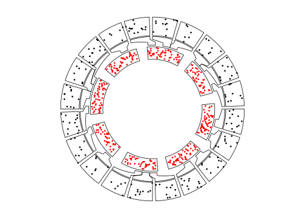
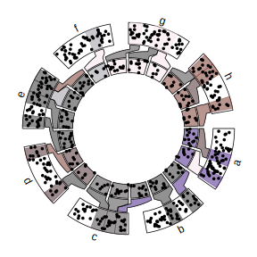
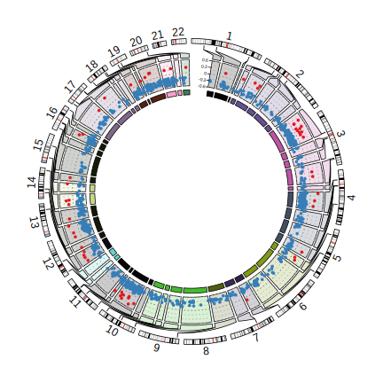

# Nested zooming {#nested-zooming}

## Basic idea

In Section \@ref(zooming-of-sectors) we introduced how to zoom sectors to the same circle
in the same track. This works fine if there are only a few regions that need to be zoomed.
However, when the regions that need to be zoomed is too many, the method will not work efficiently.
In this chapter, we introduce another zooming method which puts zoomed regions in a different
circular plot.

To illustrate the basic idea, we first generate a random data set.


```r
set.seed(123)
df = data.frame(cate = sample(letters[1:8], 400, replace = TRUE),
	            x = runif(400),
	            y = runif(400),
	            stringsAsFactors = FALSE)
df = df[order(df[[1]], df[[2]]), ]
rownames(df) = NULL
df$interval_x = as.character(cut(df$x, c(0, 0.2, 0.4, 0.6, 0.8, 1.0)))
df$name = paste(df$cate, df$interval_x, sep = ":")
df$start = as.numeric(gsub("^\\((\\d(\\.\\d)?).*(\\d(\\.\\d)?)]", "\\1", df$interval_x))
df$end = as.numeric(gsub("^\\((\\d(\\.\\d)?),(\\d(\\.\\d)?)]$", "\\3", df$interval_x))
nm = sample(unique(df$name), 20)
df2 = df[df$name %in% nm, ]

correspondance = unique(df2[, c("cate", "start", "end", "name", "start", "end")])
zoom_sector = unique(df2[, c("name", "start", "end", "cate")])
zoom_data = df2[, c("name", "x", "y")]

data = df[, 1:3]
sector = data.frame(cate = letters[1:8], start = 0, end = 1, stringsAsFactors = FALSE)

sector_col = structure(rand_color(8, transparency = 0.5), names = letters[1:8])
```

Following variables are used for downstream visualization. `sector` contains sector names
and coordinates at the x direction:


```r
head(sector, n = 4)
```

```
##   cate start end
## 1    a     0   1
## 2    b     0   1
## 3    c     0   1
## 4    d     0   1
```

`data` contains data points for a track.


```r
head(data, n = 4)
```

```
##   cate          x         y
## 1    a 0.02314449 0.2170480
## 2    a 0.03978064 0.8062479
## 3    a 0.06893260 0.6284048
## 4    a 0.07997291 0.5835629
```

In `sector`, we randomly sampled several intervals which will be used for
zooming. The zoomed intervals are stored in `zoom_sector`. In the zooming
track, each interval is treated as an independent sector, thus, the name for
each zoomed interval uses combination of the original sector name and the
interval itself, just for easy reading.


```r
head(zoom_sector, n = 4)
```

```
##           name start end cate
## 17 a:(0.4,0.6]   0.4 0.6    a
## 48   a:(0.8,1]   0.8 1.0    a
## 57   b:(0,0.2]   0.0 0.2    b
## 76 b:(0.4,0.6]   0.4 0.6    b
```

And the subset of data which are in the zoomed intervals.


```r
head(zoom_data, n = 4)
```

```
##           name         x         y
## 17 a:(0.4,0.6] 0.4072693 0.3972460
## 18 a:(0.4,0.6] 0.4186692 0.2021846
## 19 a:(0.4,0.6] 0.4481431 0.3554347
## 20 a:(0.4,0.6] 0.4597852 0.6696035
```

The correspondance between the original sectors and the zoomed intervals are
in `correspondance`. The value is a data frame with six columns. The value is
the position of the intervals in the second circular plot in the first plot.


```r
head(correspondance, n = 4)
```

```
##    cate start end        name start.1 end.1
## 17    a   0.4 0.6 a:(0.4,0.6]     0.4   0.6
## 48    a   0.8 1.0   a:(0.8,1]     0.8   1.0
## 57    b   0.0 0.2   b:(0,0.2]     0.0   0.2
## 76    b   0.4 0.6 b:(0.4,0.6]     0.4   0.6
```

The zooming is actually composed of two circulat plots where one for the
original track and one for the zoomed intervals. There is an additional connection track
which identifies which intervals that are zoomed belong to which sector. The
`circos.nested()` function in **circlize** puts the two circular plots
together, arranges them and automatically draws the connection lines.

To define "the circular plot", the code for generating the plot needs to be
wrapped into a function.


```r
f1 = function() {
	circos.par(gap.degree = 10)
	circos.initialize(sector[, 1], xlim = sector[, 2:3])
	circos.track(data[[1]], x = data[[2]], y = data[[3]], ylim = c(0, 1), 
		panel.fun = function(x, y) {
			circos.points(x, y, pch = 16, cex = 0.5, col = "red")
	})
}

f2 = function() {
	circos.par(gap.degree = 2, cell.padding = c(0, 0, 0, 0))
	circos.initialize(zoom_sector[[1]], xlim = as.matrix(zoom_sector[, 2:3]))
	circos.track(zoom_data[[1]], x = zoom_data[[2]], y = zoom_data[[3]], 
		panel.fun = function(x, y) {
			circos.points(x, y, pch = 16, cex = 0.5)
		})
}
```

In above, `f1()` is the code for generating the original plot and `f2()` is
the code for generating the zoomed plot. They can be executed independently.

To combine the two plots, simply put `f1()`, `f2()` and `corresponance` to
`circos.nested()` (Figure \@ref(fig:nested-normal)).


```r
circos.nested(f1, f2, correspondance)
```

<div class="figure" style="text-align: center">

<p class="caption">(\#fig:nested-normal)Nested zooming between two circular plots.</p>
</div>

In the plot, the zoomed circle is put inside the original circle and the start
degree for the second plot is automatically adjusted.

Zoomed circle can also be put outside by swtiching `f1()` and `f2()`.
Actually, for `circos.nested()`, It doesn't care which one is zoomed or not,
they are just two circular plots and a correspondance (Figure \@ref(fig:nested2)).


```r
circos.nested(f2, f1, correspondance[, c(4:6, 1:3)])
```

<div class="figure" style="text-align: center">

<p class="caption">(\#fig:nested2)Nested zooming between two circular plots, zoomed plot is put outside.</p>
</div>

There are some points that need to be noted while doing nested zoomings:

1. It can only be applied to the full circle.
2. If `canvas.xlim` and `canvas.ylim` are adjusted in the first plot, same
   value should be set to the second plot.
3. By default the start degree of the second plot is automatically adjusted to
   make the difference between the original positions and zoomed sectors to a
   minimal. However, users can also manually adjusted the start degree for the
   second plot by setting `circos.par("start.degree" = ...)` and
   `adjust_start_degree` must be set to `TRUE` in `circos.nested()`.
4. Since the function needs to know some information for the two circular
   plots, do not put `circos.clear()` at the end of each plot. They will be
   added internally.


`f1()` and `f2()` are just normal code for implementing circular plot. There is no problem
to make it more complex (Figure \@ref(fig:nested-complex)).


```r
sector_col = structure(rand_color(8, transparency = 0.5), names = letters[1:8])

f1 = function() {
	circos.par(gap.degree = 10)
	circos.initialize(sector[, 1], xlim = sector[, 2:3])
	circos.track(data[[1]], x = data[[2]], y = data[[3]], ylim = c(0, 1), 
		panel.fun = function(x, y) {
			l = correspondance[[1]] == CELL_META$sector.index
			if(sum(l)) {
				for(i in which(l)) {
					circos.rect(correspondance[i, 2], CELL_META$cell.ylim[1],
						        correspondance[i, 3], CELL_META$cell.ylim[2],
						        col = sector_col[CELL_META$sector.index],
						        border = sector_col[CELL_META$sector.index])
				}
			}
			circos.points(x, y, pch = 16, cex = 0.5)
			circos.text(CELL_META$xcenter, CELL_META$ylim[2] + uy(2, "mm"), 
				CELL_META$sector.index, niceFacing = TRUE, adj = c(0.5, 0))
	})
}

f2 = function() {
	circos.par(gap.degree = 2, cell.padding = c(0, 0, 0, 0))
	circos.initialize(zoom_sector[[1]], xlim = as.matrix(zoom_sector[, 2:3]))
	circos.track(zoom_data[[1]], x = zoom_data[[2]], y = zoom_data[[3]], 
		panel.fun = function(x, y) {
			circos.points(x, y, pch = 16, cex = 0.5)
		}, bg.col = sector_col[zoom_sector$cate],
		track.margin = c(0, 0))
}
circos.nested(f1, f2, correspondance, connection_col = sector_col[correspondance[[1]]])
```

<div class="figure" style="text-align: center">

<p class="caption">(\#fig:nested-complex)Nested zooming between two circular plots, slightly complex plots.</p>
</div>

## Visualization of DMRs from tagmentation-based WGBS

[Tagmentation-based whole-genome bisulfite sequencing](http://www.nature.com/nprot/journal/v8/n10/full/nprot.2013.118.html) 
(T-WGBS) is a technology which can examine only a minor fraction of methylome of interest. 
In this section, we demonstrate how to visualize DMRs which are detected from T-WGBS data in a circular plot by **circlize** package.

In the example data loaded, `tagments` contains regions which are sequenced, 
`DMR1` contains DMRs for one patient detectd in tagment regions. Correspondance between tagment regions
and original genome is stored in `correspondance`.


```r
load(system.file(package = "circlize", "extdata", "tagments_WGBS_DMR.RData"))
head(tagments, n = 4)
```

```
##                   tagments     start       end  chr
## 1   chr1-44876009-45016546  44876009  45016546 chr1
## 2   chr1-90460304-90761641  90460304  90761641 chr1
## 3 chr1-211666507-211692757 211666507 211692757 chr1
## 4   chr2-46387184-46477385  46387184  46477385 chr2
```

```r
head(DMR1, n = 4)
```

```
##                      chr    start      end   methDiff
## 1 chr1-44876009-45016546 44894352 44894643 -0.2812889
## 2 chr1-44876009-45016546 44902069 44902966 -0.3331170
## 3 chr1-90460304-90761641 90535428 90536046 -0.3550701
## 4 chr1-90460304-90761641 90546991 90547262 -0.4310808
```

```r
head(correspondance, n = 4)
```

```
##    chr     start       end                 tagments   start.1     end.1
## 1 chr1  44876009  45016546   chr1-44876009-45016546  44876009  45016546
## 2 chr1  90460304  90761641   chr1-90460304-90761641  90460304  90761641
## 3 chr1 211666507 211692757 chr1-211666507-211692757 211666507 211692757
## 4 chr2  46387184  46477385   chr2-46387184-46477385  46387184  46477385
```

In Figure \@ref(fig:dmr), the tagment regions are actually zoomed from the genome. In following code,
`f1()` only makes a circular plot with whole genome and `f2()` makes circular plot for the tagment regions.


```r
chr_bg_color = rand_color(22, transparency = 0.8)
names(chr_bg_color) = paste0("chr", 1:22)

f1 = function() {
	circos.par(gap.after = 2, start.degree = 90)
	circos.initializeWithIdeogram(chromosome.index = paste0("chr", 1:22), 
		plotType = c("ideogram", "labels"), ideogram.height = 0.03)
}

f2 = function() {
	circos.par(cell.padding = c(0, 0, 0, 0), gap.after = c(rep(1, nrow(tagments)-1), 10))
	circos.genomicInitialize(tagments, plotType = NULL)
	circos.genomicTrack(DMR1, ylim = c(-0.6, 0.6), 
		panel.fun = function(region, value, ...) {
			for(h in seq(-0.6, 0.6, by = 0.2)) {
		        circos.lines(CELL_META$cell.xlim, c(h, h), lty = 3, col = "#AAAAAA")
		    }
		    circos.lines(CELL_META$cell.xlim, c(0, 0), lty = 3, col = "#888888")
	    
			circos.genomicPoints(region, value, 
				col = ifelse(value[[1]] > 0, "#E41A1C", "#377EB8"), 
				pch = 16, cex = 0.5)
	}, bg.col = chr_bg_color[tagments$chr], track.margin = c(0.02, 0))
	circos.yaxis(side = "left", at = seq(-0.6, 0.6, by = 0.3), 
		sector.index = get.all.sector.index()[1], labels.cex = 0.4)
	circos.track(ylim = c(0, 1), track.height = uh(2, "mm"), 
		bg.col = add_transparency(chr_bg_color[tagments$chr], 0))
}

circos.nested(f1, f2, correspondance, connection_col = chr_bg_color[correspondance[[1]]])
```

<div class="figure" style="text-align: center">

<p class="caption">(\#fig:dmr)Visualization of DMRs.</p>
</div>
