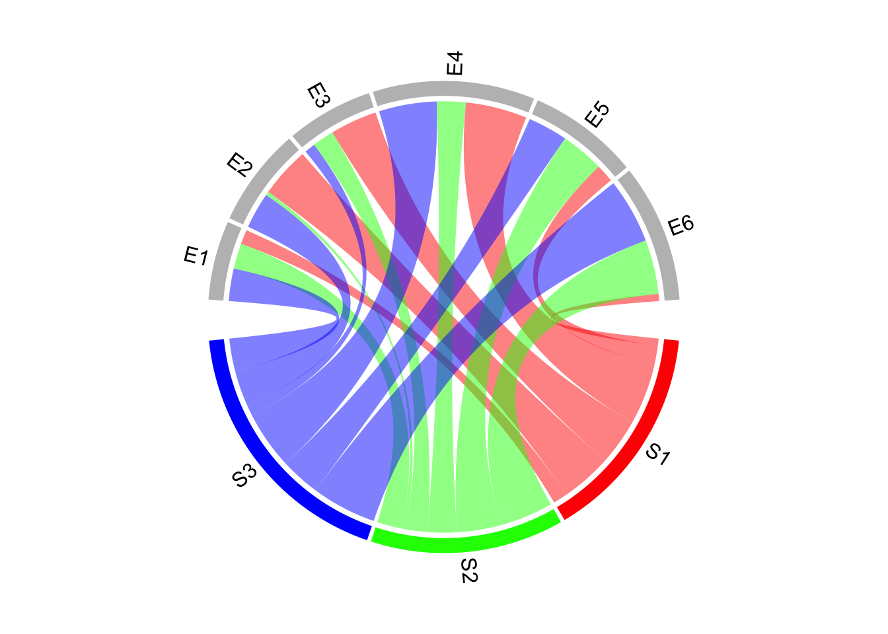
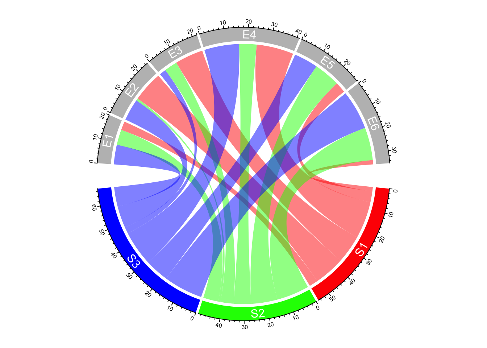
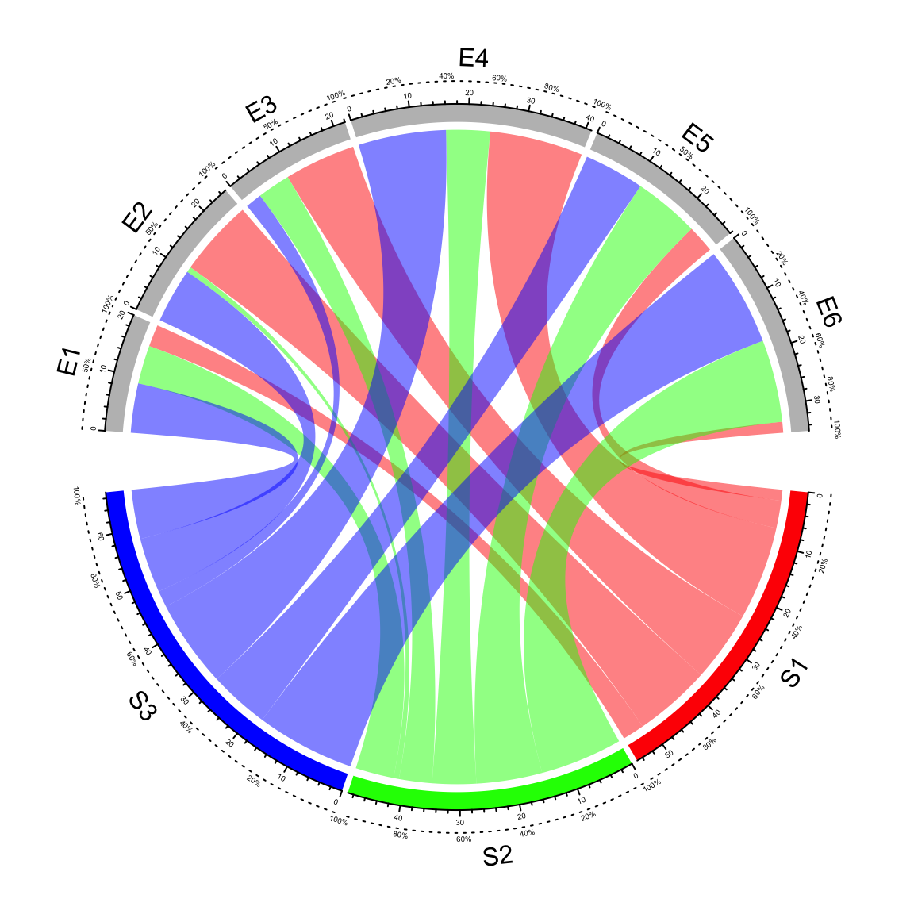
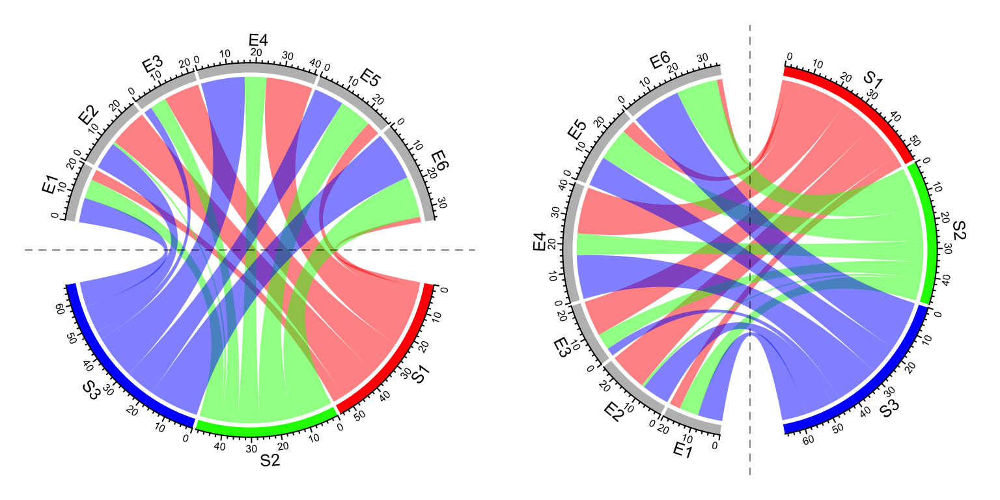
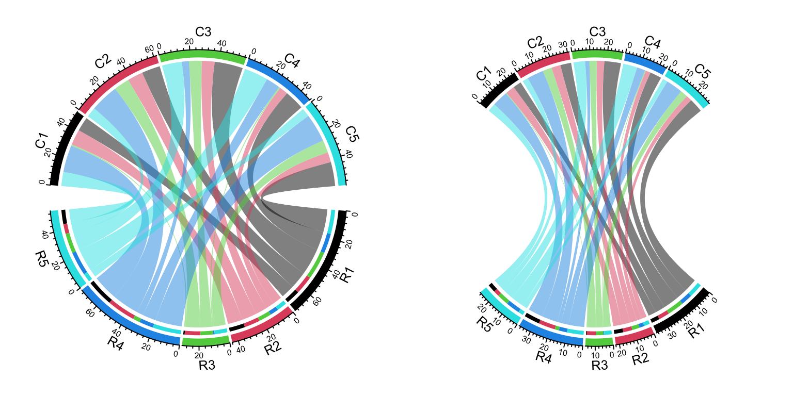
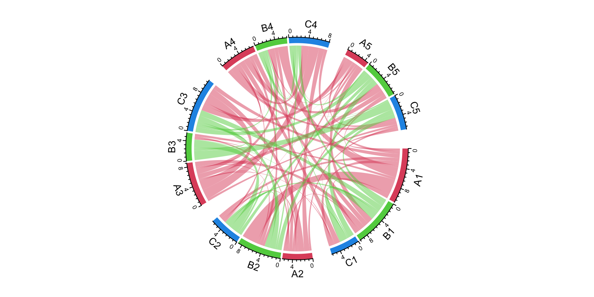
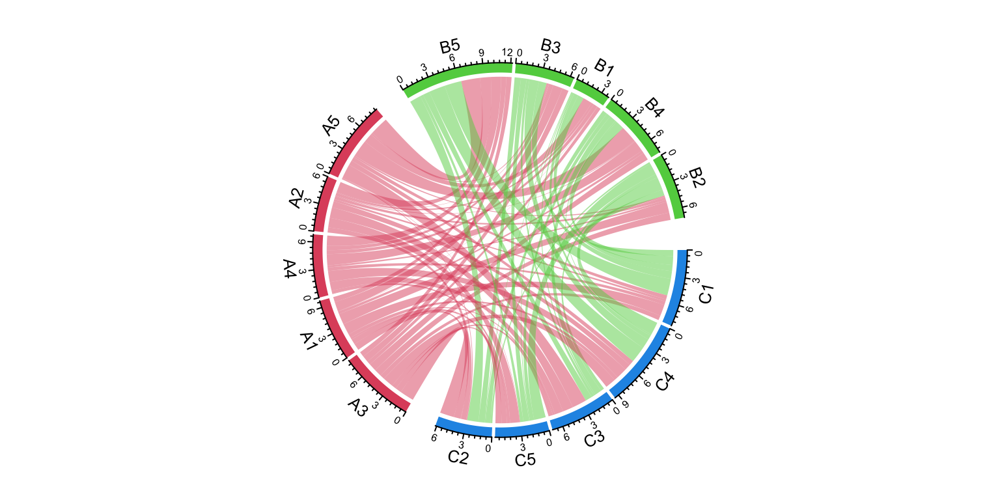
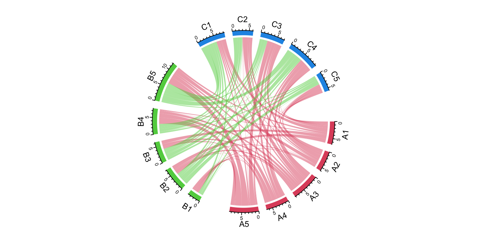

# Advanced usage of `chordDiagram()`

The default style of `chordDiagram()` is somehow enough for most visualization
tasks, still you can have more configurations on the plot.

The usage is same for both ajacency matrix and ajacency list, so we only
demonstrate with the matrix.

## Organization of tracks

By default, `chordDiagram()` creates two tracks, one track for labels and one
track for grids with axes.


```r
chordDiagram(mat)
circos.info()
```

```
## All your sectors:
## [1] "S1" "S2" "S3" "E1" "E2" "E3" "E4" "E5" "E6"
## 
## All your tracks:
## [1] 1 2
## 
## Your current sector.index is E6
## Your current track.index is 2
```

These two tracks can be controlled by `annotationTrack` argument. Available
values for this argument are `grid`, `name` and `axis`. The height of
annotation tracks can be set by `annotationTrackHeight` which is the
percentage to the radius of unit circle and can be set by `mm_h()` function with
an absolute unit. Axes are only added if `grid` is set in `annotationTrack` 
(Figure \@ref(fig:chord-diagram-default-track)).


```r
chordDiagram(mat, grid.col = grid.col, annotationTrack = "grid")
chordDiagram(mat, grid.col = grid.col, annotationTrack = c("name", "grid"),
    annotationTrackHeight = c(0.03, 0.01))
chordDiagram(mat, grid.col = grid.col, annotationTrack = NULL)
```

<div class="figure" style="text-align: center">

<p class="caption">(\#fig:chord-diagram-default-track)Track organization in `chordDiagram()`.</p>
</div>

Several empty tracks can be allocated before Chord diagram is drawn. Then self-defined graphics can
be added to these empty tracks afterwards. The number of pre-allocated tracks can be set 
through `preAllocateTracks`.


```r
chordDiagram(mat, preAllocateTracks = 2)
circos.info()
```

```
## All your sectors:
## [1] "S1" "S2" "S3" "E1" "E2" "E3" "E4" "E5" "E6"
## 
## All your tracks:
## [1] 1 2 3 4
## 
## Your current sector.index is E6
## Your current track.index is 4
```

The default settings for pre-allocated tracks are:


```r
list(ylim = c(0, 1),
     track.height = circos.par("track.height"),
     bg.col = NA,
     bg.border = NA,
     bg.lty = par("lty"),
     bg.lwd = par("lwd"))
```

The default settings for pre-allocated tracks can be overwritten by specifying `preAllocateTracks`
as a list.


```r
chordDiagram(mat, annotationTrack = NULL,
    preAllocateTracks = list(track.height = 0.3))
```

If more than one tracks need to be pre-allocated, just specify `preAllocateTracks`
as a list which contains settings for each track:


```r
chordDiagram(mat, annotationTrack = NULL,
    preAllocateTracks = list(list(track.height = 0.1),
                             list(bg.border = "black")))
```

By default `chordDiagram()` provides poor supports for customization of sector
labels and axes, but with `preAllocateTracks` it is rather easy to customize
them. Such customization will be introduced in next section.

## Customize sector labels

In `chordDiagram()`, there is no argument to control the style of sector
labels, but this can be done by first pre-allocating an empty track and
customizing the labels in it later. In the following example, one track is
firstly allocated and a Chord diagram is added without label track and axes.
Later, the first track is updated with adding labels with clockwise facings
(Figure \@ref(fig:chord-diagram-labels-show)).


```r
chordDiagram(mat, grid.col = grid.col, annotationTrack = "grid", 
    preAllocateTracks = list(track.height = max(strwidth(unlist(dimnames(mat))))))
# we go back to the first track and customize sector labels
circos.track(track.index = 1, panel.fun = function(x, y) {
    circos.text(CELL_META$xcenter, CELL_META$ylim[1], CELL_META$sector.index, 
        facing = "clockwise", niceFacing = TRUE, adj = c(0, 0.5))
}, bg.border = NA) # here set bg.border to NA is important
```

<div class="figure" style="text-align: center">

<p class="caption">(\#fig:chord-diagram-labels-show)Change label directions.</p>
</div>

In the following example, the labels are put on the grids (Figure \@ref(fig:chord-diagram-labels-inside)). 
Please note `circos.text()` and
`get.cell.meta.data()` can be used outside `panel.fun` if the sector index and
track index are specified explicitly.


```r
chordDiagram(mat, grid.col = grid.col, 
    annotationTrack = c("grid", "axis"), annotationTrackHeight = mm_h(5))
for(si in get.all.sector.index()) {
    xlim = get.cell.meta.data("xlim", sector.index = si, track.index = 1)
    ylim = get.cell.meta.data("ylim", sector.index = si, track.index = 1)
    circos.text(mean(xlim), mean(ylim), si, sector.index = si, track.index = 1, 
        facing = "bending.inside", niceFacing = TRUE, col = "white")
}
```

<div class="figure" style="text-align: center">

<p class="caption">(\#fig:chord-diagram-labels-inside)Put sector labels to the grid.</p>
</div>

For the last example in this section, if the width of the sector is less than
20 degree, the labels are added in the radical direction (Figure \@ref(fig:chord-diagram-labels-multile-style)).


```r
set.seed(123)
mat2 = matrix(rnorm(100), 10)
chordDiagram(mat2, annotationTrack = "grid", 
    preAllocateTracks = list(track.height = max(strwidth(unlist(dimnames(mat))))))
circos.track(track.index = 1, panel.fun = function(x, y) {
    xlim = get.cell.meta.data("xlim")
    xplot = get.cell.meta.data("xplot")
    ylim = get.cell.meta.data("ylim")
    sector.name = get.cell.meta.data("sector.index")

    if(abs(xplot[2] - xplot[1]) < 20) {
        circos.text(mean(xlim), ylim[1], sector.name, facing = "clockwise",
            niceFacing = TRUE, adj = c(0, 0.5), col = "red")
    } else {
        circos.text(mean(xlim), ylim[1], sector.name, facing = "inside", 
            niceFacing = TRUE, adj = c(0.5, 0), col= "blue")
    }
}, bg.border = NA)
```

<div class="figure" style="text-align: center">

<p class="caption">(\#fig:chord-diagram-labels-multile-style)Adjust label direction according to the width of sectors.</p>
</div>

When you set direction of sector labels as radical (`clockwise` or
`reverse.clockwise`), if the labels are too long and exceed your figure
region, you can either decrease the size of the font or set `canvas.xlim` and
`canvas.ylim` parameters in `circos.par()` to wider intervals.

## Customize sector axes

Axes are helpful to correspond to the absolute values of links. By default
`chordDiagram()` adds axes on the grid track. But it is easy to customize one
with self-defined code.

In following example code, we draw another type of axes which show relative
percent on sectors. We first pre-allocate an empty track by
`preAllocateTracks` and come back to this track to add axes later.

You may see we add the first axes to the top of second track. You can also
put them to the bottom of the first track.


```r
# similar as the previous example, but we only plot the grid track
chordDiagram(mat, grid.col = grid.col, annotationTrack = "grid", 
    preAllocateTracks = list(track.height = mm_h(5)))
for(si in get.all.sector.index()) {
    circos.axis(h = "top", labels.cex = 0.3, sector.index = si, track.index = 2)
}
```

Now we go back to the first track to add the second type of axes and sector names.
In `panel.fun`, if the sector is less than 30 degree, the break for the axis is set to 0.5
(Figure \@ref(fig:chord-diagram-axes)).


```r
# the second axis as well as the sector labels are added in this track
circos.track(track.index = 1, panel.fun = function(x, y) {
    xlim = get.cell.meta.data("xlim")
    ylim = get.cell.meta.data("ylim")
    sector.name = get.cell.meta.data("sector.index")
    xplot = get.cell.meta.data("xplot")
    
    circos.lines(xlim, c(mean(ylim), mean(ylim)), lty = 3) # dotted line
    by = ifelse(abs(xplot[2] - xplot[1]) > 30, 0.2, 0.5)
    for(p in seq(by, 1, by = by)) {
        circos.text(p*(xlim[2] - xlim[1]) + xlim[1], mean(ylim) + 0.1, 
            paste0(p*100, "%"), cex = 0.3, adj = c(0.5, 0), niceFacing = TRUE)
    }
    
    circos.text(mean(xlim), 1, sector.name, niceFacing = TRUE, adj = c(0.5, 0))
}, bg.border = NA)
circos.clear()
```

<div class="figure" style="text-align: center">

<p class="caption">(\#fig:chord-diagram-axes)Customize sector axes for Chord diagram.</p>
</div>

## Put horizontally or vertically symmetric

In Chord diagram, when there are two groups (which correspond to rows and columns
if the input is an adjacency matrix), it is always visually beautiful to rotate the diagram
to be symmetric on horizontal direction or vertical direction. See following example:


```r
par(mfrow = c(1, 2))
circos.par(start.degree = 0)
chordDiagram(mat, grid.col = grid.col, big.gap = 20)
abline(h = 0, lty = 2, col = "#00000080")
circos.clear()

circos.par(start.degree = 90)
chordDiagram(mat, grid.col = grid.col, big.gap = 20)
abline(v = 0, lty = 2, col = "#00000080")
```

<div class="figure" style="text-align: center">

<p class="caption">(\#fig:chord-diagram-sym)Rotate Chord diagram.</p>
</div>

```r
circos.clear()
```

## Compare two Chord diagrams

Normally, in Chord diagram, values in `mat` are normalized to the summation of
the absolute values in the matrix, which means the width for links only
represents relative values. Then, when comparing two Chord diagrams, it is
necessary that unit width of links in the two plots should be represented in a
same scale. This problem can be solved by adding larger gaps to the Chord
diagram which has smaller matrix.

First we make the "big" Chord diagram.


```r
mat1 = matrix(sample(20, 25, replace = TRUE), 5)
chordDiagram(mat1, directional = 1, grid.col = rep(1:5, 2), transparency = 0.5,
    big.gap = 10, small.gap = 1) # 10 and 1 are default values for the two arguments
```

The second matrix only has half the values in `mat1`.


```r
mat2 = mat1 / 2
```

`calc_gap()` can be used to calculate the gap for the second Chord diagram
to make the scale of the two Chord diagram the same.


```r
gap = calc_gap(mat1, mat2, big.gap = 10, small.gap = 1)
chordDiagram(mat2, directional = 1, grid.col = rep(1:5, 2), transparency = 0.5,
    big.gap = gap, small.gap = 1)
```

Now the scale of the two Chord diagrams (Figure \@ref(fig:chord-diagram-compare)) are the 
same if you compare the scale of axes in the two diagrams.

<div class="figure" style="text-align: center">

<p class="caption">(\#fig:chord-diagram-compare)Compare two Chord Diagrams in a same scale.</p>
</div>

To correctly use the functionality of `calc_gap()`, the two Chord diagram should
have same value for `small.gap` and there should be no overlap between the two
sets of the sectors.

## Multiple-group Chord diagram {#multiple-group-chord-diagram}


From verion 0.4.10 of the **circlize** package, there is a new `group`
argument in `chordDiagram()` function which is very convenient for making
multiple-group Chord diagrams.

I first generate a random matrix where there are three groups (`A`, `B`, and `C`).
Note this new functionality works the same for the input as a data frame.


```r
library(circlize)
mat1 = matrix(rnorm(25), nrow = 5)
rownames(mat1) = paste0("A", 1:5)
colnames(mat1) = paste0("B", 1:5)

mat2 = matrix(rnorm(25), nrow = 5)
rownames(mat2) = paste0("A", 1:5)
colnames(mat2) = paste0("C", 1:5)

mat3 = matrix(rnorm(25), nrow = 5)
rownames(mat3) = paste0("B", 1:5)
colnames(mat3) = paste0("C", 1:5)

mat = matrix(0, nrow = 10, ncol = 10)
rownames(mat) = c(rownames(mat2), rownames(mat3))
colnames(mat) = c(colnames(mat1), colnames(mat2))
mat[rownames(mat1), colnames(mat1)] = mat1
mat[rownames(mat2), colnames(mat2)] = mat2
mat[rownames(mat3), colnames(mat3)] = mat3
mat
```

```
##            B1         B2          B3         B4         B5          C1
## A1  0.9769734  3.2410399  0.51686204  2.1284519  0.4365235 -0.86551286
## A2 -0.3745809 -0.4168576  0.36896453 -0.7413361 -0.4583653 -0.23627957
## A3  1.0527115  0.2982276 -0.21538051 -1.0959963 -1.0633261 -0.19717589
## A4 -1.0491770  0.6365697  0.06529303  0.0377884  1.2631852  1.10992029
## A5 -1.2601552 -0.4837806 -0.03406725  0.3104807 -0.3496504  0.08473729
## B1  0.0000000  0.0000000  0.00000000  0.0000000  0.0000000  1.65090747
## B2  0.0000000  0.0000000  0.00000000  0.0000000  0.0000000 -0.05402813
## B3  0.0000000  0.0000000  0.00000000  0.0000000  0.0000000  0.11924524
## B4  0.0000000  0.0000000  0.00000000  0.0000000  0.0000000  0.24368743
## B5  0.0000000  0.0000000  0.00000000  0.0000000  0.0000000  1.23247588
##             C2         C3          C4          C5
## A1  0.75405379 -0.8953634 -0.61116592  0.54319406
## A2 -0.49929202 -1.3108015 -1.18548008 -0.41433995
## A3  0.21444531  1.9972134  2.19881035 -0.47624689
## A4 -0.32468591  0.6007088  1.31241298 -0.78860284
## A5  0.09458353 -1.2512714 -0.26514506 -0.59461727
## B1 -0.51606383 -1.2362731  0.70758835  0.88465050
## B2 -0.99250715 -1.2847157 -0.36365730 -1.01559258
## B3  1.67569693 -0.5739735  0.05974994  1.95529397
## B4 -0.44116322  0.6179858 -0.70459646 -0.09031959
## B5 -0.72306597  1.1098481 -0.71721816  0.21453883
```

The main thing is to create "a grouping variable". The variable contains
the group labels and the sector names are used as the names in the vector.


```r
nm = unique(unlist(dimnames(mat)))
group = structure(gsub("\\d", "", nm), names = nm)
group
```

```
##  A1  A2  A3  A4  A5  B1  B2  B3  B4  B5  C1  C2  C3  C4  C5 
## "A" "A" "A" "A" "A" "B" "B" "B" "B" "B" "C" "C" "C" "C" "C"
```

Assign `group` variable to the `group` argument:


```
## Warning: 'gap.degree' can only be modified before `circos.initialize`, or maybe
## you forgot to call `circos.clear` in your last plot.
```

<div class="figure" style="text-align: center">

<p class="caption">(\#fig:chord-grouped)Grouped Chord diagram.</p>
</div>

We can try another grouping:


```
##  A1  A2  A3  A4  A5  B1  B2  B3  B4  B5  C1  C2  C3  C4  C5 
## "1" "2" "3" "4" "5" "1" "2" "3" "4" "5" "1" "2" "3" "4" "5"
```

<div class="figure" style="text-align: center">

<p class="caption">(\#fig:chord-grouped2)Grouped Chord diagram. A different grouping.</p>
</div>

The order of `group` controls the sector orders and if `group` is set as a factor,
the order of levels controls the order of groups.


```
## B3 A3 B5 B2 C1 A1 A2 C4 A5 C2 C5 B4 A4 B1 C3 
##  B  A  B  B  C  A  A  C  A  C  C  B  A  B  C 
## Levels: C A B
```

<div class="figure" style="text-align: center">

<p class="caption">(\#fig:chord-grouped3)Grouped Chord diagram. Control the orders of groups.</p>
</div>

The gap between groups is controlled by `big.gap` argument and the gap between
sectors is controlled by `small.gap` argument.

<div class="figure" style="text-align: center">

<p class="caption">(\#fig:chord-grouped4)Grouped Chord diagram. Control the gaps between groups.</p>
</div>

As a normal Chord diagram, the labels and other tracks can be manually adjusted:

<div class="figure" style="text-align: center">

<p class="caption">(\#fig:chord-grouped5)A more customized grouped Chord diagram.</p>
</div>
