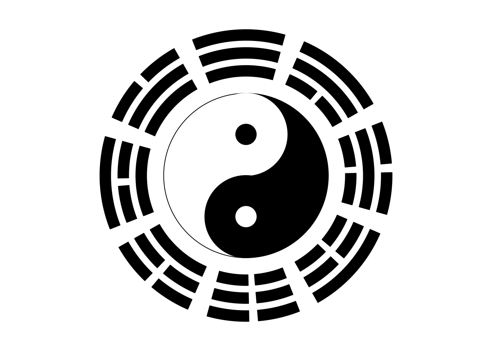

# (PART) Others {-}

# Make fun of the package {#make-fun-of-the-package}

## A clock

The first example is a clock. The key function here is `circos.axis()` (Figure
\@ref(fig:clock)). In the example, the whole circle only contains one sector in
which major tick at 0 is overlapping with major tick at 12.

Later we calculate the positions of the hour hand, the minute hand and the second hand
based on current time when this Chapter is generated. The hands are drawn by `arraws()` function
in the canvas coordinate. A real-time clock can be found at the **Examples** section in
the help page of `circos.axis()`.


```r
circos.par(gap.degree = 0, cell.padding = c(0, 0, 0, 0), start.degree = 90)
circos.initialize(factors = "a", xlim = c(0, 12))
circos.track(ylim = c(0, 1), bg.border = NA)
circos.axis(major.at = 0:12, labels = NULL, direction = "inside", 
    major.tick.length = mm_y(2))
circos.text(1:12, rep(1, 12) - mm_y(6), 1:12, facing = "downward")

current.time = as.POSIXlt(Sys.time())
sec = ceiling(current.time$sec)
min = current.time$min
hour = current.time$hour

sec.degree = 90 - sec/60 * 360
arrows(0, 0, cos(sec.degree/180*pi)*0.8, sin(sec.degree/180*pi)*0.8)

min.degree = 90 - min/60 * 360
arrows(0, 0, cos(min.degree/180*pi)*0.7, sin(min.degree/180*pi)*0.7, lwd = 2)   

hour.degree = 90 - hour/12 * 360 - min/60 * 360/12
arrows(0, 0, cos(hour.degree/180*pi)*0.4, sin(hour.degree/180*pi)*0.4, lwd = 2)
```

<div class="figure" style="text-align: center">

<p class="caption">(\#fig:clock)A clock.</p>
</div>

```r
circos.clear()
```

## A dartboard

The second example is a dartboard. In Figure \@ref(fig:dartboard), tracks are assigned with
different heights and each cell is initialized with different colors. The most
inside green ring and red circle are plotted by `draw.sector()`.

We use `circos.trackText()` to add labels because we know the global order of the labels.

Now you can project the plot on your door and begin to play!


```r
factors = 1:20  # just indicate there are 20 sectors
circos.par(gap.degree = 0, cell.padding = c(0, 0, 0, 0),
    start.degree = 360/20/2, track.margin = c(0, 0), clock.wise = FALSE)
circos.initialize(factors = factors, xlim = c(0, 1))

circos.track(ylim = c(0, 1), factors = factors, bg.col = "black", track.height = 0.15)
circos.trackText(x = rep(0.5, 20), y = rep(0.5, 20),
    labels = c(13, 4, 18, 1, 20, 5, 12, 9, 14, 11, 8, 16, 7, 19, 3, 17, 2, 15, 10, 6),
    cex = 0.8, factors = factors, col = "#EEEEEE", font = 2, facing = "downward")
circos.track(ylim = c(0, 1), factors = factors,
    bg.col = rep(c("#E41A1C", "#4DAF4A"), 10), bg.border = "#EEEEEE", track.height = 0.05)
circos.track(ylim = c(0, 1), factors = factors,
    bg.col = rep(c("black", "white"), 10), bg.border = "#EEEEEE", track.height = 0.275)
circos.track(ylim = c(0, 1), factors = factors,
    bg.col = rep(c("#E41A1C", "#4DAF4A"), 10), bg.border = "#EEEEEE", track.height = 0.05)
circos.track(ylim = c(0, 1), factors = factors, 
    bg.col = rep(c("black", "white"), 10), bg.border = "#EEEEEE", track.height = 0.375)

draw.sector(center = c(0, 0), start.degree = 0, end.degree = 360,
    rou1 = 0.1, col = "#4DAF4A", border = "#EEEEEE")
draw.sector(center = c(0, 0), start.degree = 0, end.degree = 360,
    rou1 = 0.05, col = "#E41A1C", border = "#EEEEEE")
```

<div class="figure" style="text-align: center">

<p class="caption">(\#fig:dartboard)A dartboard.</p>
</div>

```r
circos.clear()
```

## Ba-Gua and Tai-Ji

The third example is [Ba-Gua](https://en.wikipedia.org/wiki/Bagua). The
key functions are `circos.rect()` and `draw.sector()` (Figure \@ref(fig:bagua)). 

Bagua was originated several thousands years ago in China. It is the source of
almost all ancient Chinese philosophy. It abstracts the rule of universe into
base signs and combination of the two basic signs generates the whole system
of the universe.

Inside Ba-Gua, these is the [Tai-Ji](http://en.wikipedia.org/wiki/Taiji_(philosophy)). Tai-Ji refers to the
most original state at the creation of the universe. In ancient Chinese
philosophy system, at the very beginning, the whole world is a huge mass of
air (chaos). Then the lighter air floated up and created sky while heavier
sinked down and created ground. The upper world is called Yang and the bottom
world is called Ying. And that is Tai-Ji.

Looking at Tai-Ji, you can see there are two states interacting with each
other. The white one and the black one gradually transformed into each other
at the end. And in the center of white and black, the opposite color is
generated. In real world, Taiji can represent all phenomenon that is of
dualism. Such as male and female, correct and wrong. However things would
change, good thing would become bad thing as time goes by, and bad thing would
also turn into good according to how you look at the world.


```r
factors = 1:8
circos.par(start.degree = 22.5, gap.degree = 6)
circos.initialize(factors = factors, xlim = c(0, 1))

# yang yao is __ (a long segment)
add_yang_yao = function() {
    circos.rect(0,0,1,1, col = "black")
}

# yin yao is -- (two short segments)
add_yin_yao = function() {
    circos.rect(0,0,0.45,1, col = "black")
    circos.rect(0.55,0,1,1, col = "black")
}
circos.track(ylim = c(0, 1), factors = factors, bg.border = NA,
    panel.fun = function(x, y) {
        i = get.cell.meta.data("sector.numeric.index")
        if(i %in% c(2, 5, 7, 8)) add_yang_yao() else add_yin_yao()
}, track.height = 0.1)

circos.track(ylim = c(0, 1), factors = factors, bg.border = NA,
    panel.fun = function(x, y) {
        i = get.cell.meta.data("sector.numeric.index")
        if(i %in% c(1, 6, 7, 8)) add_yang_yao() else add_yin_yao()
    }, track.height = 0.1)

circos.track(ylim = c(0, 1), factors = factors, bg.border = NA, 
    panel.fun = function(x, y) {
        i = get.cell.meta.data("sector.numeric.index")
        if(i %in% c(4, 5, 6, 7)) add_yang_yao() else add_yin_yao()
    }, track.height = 0.1)

# the bottom of the most recent track
r = get.cell.meta.data("cell.bottom.radius") - 0.1
# draw taiji, note default order is clock wise for `draw.sector`
draw.sector(center = c(0, 0), start.degree = 90, end.degree = -90,
    rou1 = r, col = "black", border = "black")
draw.sector(center = c(0, 0), start.degree = 270, end.degree = 90,
    rou1 = r, col = "white", border = "black")
draw.sector(center = c(0, r/2), start.degree = 0, end.degree = 360,
    rou1 = r/2, col = "white", border = "white")
draw.sector(center = c(0, -r/2), start.degree = 0, end.degree = 360,
    rou1 = r/2, col = "black", border = "black")
draw.sector(center = c(0, r/2), start.degree = 0, end.degree = 360,
    rou1 = r/8, col = "black", border = "black")
draw.sector(center = c(0, -r/2), start.degree = 0, end.degree = 360,
    rou1 = r/8, col = "white", border = "white")
```

<div class="figure" style="text-align: center">

<p class="caption">(\#fig:bagua)Ba-Gua and Tai-Ji.</p>
</div>

```r
circos.clear()
```


