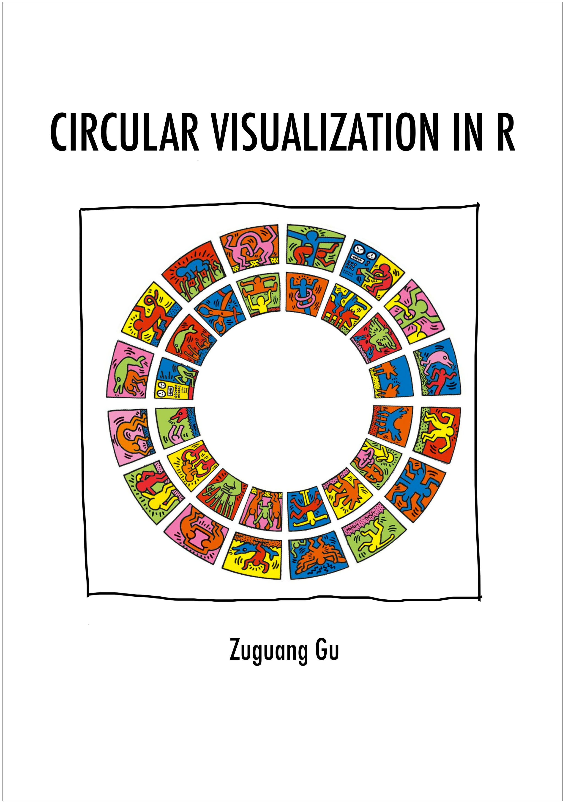

--- 
title: "Circular Visualization in R"
author: "Zuguang Gu"
date: "last revised on 2019-07-08"
site: bookdown::bookdown_site
output: bookdown::gitbook
documentclass: book
bibliography: [book.bib]
biblio-style: apalike
link-citations: yes
github-repo: jokergoo/circlize_book
cover-image: images/circlize_cover.jpg
url: 'https\://bookdown.org/jokergoo/circlize-book/book'
description: "This book provides a comprehensive overview of implementing circular visualization in R by cirlize package, espeically focusing on visualizaing high dimentional genomic data and revealing complex relationships by Chord diagram."
---

# About {-}

This is the documentation of the
[**circlize**](https://cran.r-project.org/package=circlize) package. Examples
in the book are generated under version 0.4.7.

If you use **circlize** in your publications, I am appreciated if you can cite:

Gu, Z. (2014) circlize implements and enhances circular visualization in R.
Bioinformatics. DOI:
[10.1093/bioinformatics/btu393](https://doi.org/10.1093/bioinformatics/btu393)

