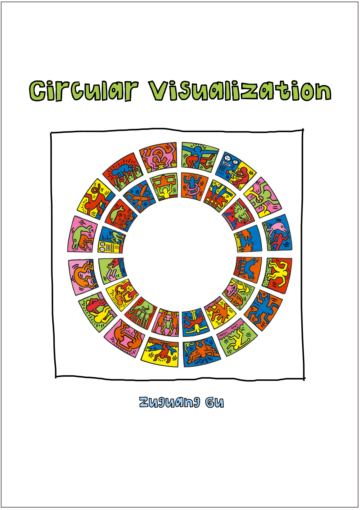

--- 
title: "Circular Visualization"
author: "Zuguang Gu"
date: "last revised on `r Sys.Date()`"
site: bookdown::bookdown_site
output: bookdown::gitbook
documentclass: book
bibliography: [book.bib]
biblio-style: apalike
link-citations: yes
github-repo: rstudio/bookdown-demo
description: "This book provides a comprehensive overview of implementing circular visualization by cirlize package in R."
---

# About {-}

This is the documentation of the [**circlize**](https://cran.r-project.org/package=circlize) package (illustrated with version `r installed.packages()["circlize", "Version"]`).



If you use **circlize** in your publications, I would be appreciated if you can cite:

```{block}
Gu, Z. (2014) circlize implements and enhances circular visualization in R. Bioinformatics. DOI: [10.1093/bioinformatics/btu393](https://doi.org/10.1093/bioinformatics/btu393)
```
